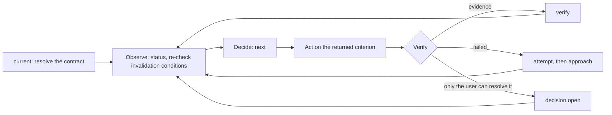

# Codex Goal Loop

Use one JSON contract for goal semantics and evidence state, and `scripts/goal.py` for every contract transition. Keep the objective and acceptance criteria stable while evidence, approaches, facts, and risks evolve.

## Authority

- `protected` in the referenced contract is the sole authority for the objective, acceptance criteria, constraints, non-goals, and `max_attempts`. The title is display metadata.
- The contract is the only state this Skill owns. `current` resolves it from `.goal/`.
- `working` stores facts only: current approach, steps, failed attempts, evidence, risks, and decisions. Criterion state (open, blocked, exhausted, verified) is derived by the script and never stored.
- [`schemas/goal.schema.json`](schemas/goal.schema.json) plus the invariants in `scripts/goal.py` are the sole authority for contract shape. A contract the script rejects is not a contract.

## Invariants

- Read and mutate the contract only through `scripts/goal.py`. Never hand-edit the JSON.
- Preserve `protected`. Change any part of it only through a refinement decision the user approved, applied by `decision resolve --approve`.
- Open a refinement decision when evidence contradicts a criterion or shows that no authorized action can satisfy it.
- During Act, work only on the criterion `next` returned. Observe may touch any criterion.
- Mark a criterion verified only with observable evidence: a summary, a locator where it can be re-observed, and at least one invalidation condition. `verify` refuses while any step of that criterion is undone; close or drop each step explicitly.
- Break a criterion into `steps` whose text names something re-observable: a command, a file, or an id list, never "continue". The next step is derived, not stored.
- On every resume, re-check each verified criterion against its invalidation conditions and current state. Run `invalidate` when a condition has occurred, then add fresh steps for the work the new evidence requires. Re-observe what the first undone step points to before acting on it; drop steps the workspace shows are already done or no longer needed.
- Record a failed approach with `attempt` before choosing a new one.
- After `max_attempts` failed approaches on one criterion (default 10, stored in `protected`), the script refuses new approaches. Open a refinement or input decision instead of trying again; an approved decision on that criterion restores its attempt budget.
- Treat context reset and execution-budget exhaustion as handoffs rather than blockers.
- Do not revert or overwrite changes that cannot be attributed to the current goal.

## Lifecycle

A contract has three states, all derived from its own content:

- Open: at least one criterion is neither verified, blocked, nor exhausted. Work on the one `next` returns.
- Awaiting the user: every unverified criterion is blocked or exhausted. Report the exact request and stop.
- Done: `ready` exits 0. Report completion. `current` no longer returns it, so the next goal starts clean.

`current` returns the contract while it is Open or Awaiting the user. Steps added to an already verified criterion are inert; invalidate it first if its evidence no longer holds.

Creating a contract requires an explicit request, such as `$codex-goal-loop <intent>`. Automatic Skill selection and a bare `$codex-goal-loop` create nothing.

## Runtime Goal

The environment has its own goal mechanism that keeps re-invoking the agent turn after turn. It is the driver; this Skill is what each turn does. They own different things and neither replaces the other:

| Concern | Owner |
| --- | --- |
| Whether another turn happens, and any budget or status around it | The runtime goal |
| Objective, acceptance criteria, evidence, and when the work is done | This contract |

Setting a runtime goal is the user's call. When they ask for one over work this Skill is running, write its objective as a pointer, never a copy:

```text
Pursue the contract at .goal/<file>.json with $codex-goal-loop until `ready` passes.
```

`init` prints that line with the real path. Any language works as long as it names `$codex-goal-loop` and the contract path.

- Naming the Skill routes every unattended turn back through this workflow. Without it a turn works straight from the objective text, records no evidence, and never consults `ready`.
- Naming the contract keeps `protected` the only copy of the acceptance criteria. Restating them in the objective creates a second copy that goes stale as soon as a refinement is approved.

Beyond writing that objective, the runtime goal is not this Skill's business. Do not read, route on, or mirror its status, and never make progress conditional on it.

## Workflow



- Observe: run `current` then `status`, re-observe repository and external state, `invalidate` evidence whose invalidation condition occurred, and `risk` to add or drop open risks.
- Decide: `next` names the single criterion to pursue and its first undone step, or reports that decisions are pending or completion is ready. Set or change the approach with `approach`; list the remaining work with `step add`.
- Act: do the first undone step of that criterion only, then `step done`.
- Verify: `verify` with evidence, `attempt` with the observed failure, or `decision open` when only the user can resolve the blocker.
- The script rejects an approach the contract already records as failed. Change the hypothesis before retrying.
- Complete: `ready` exits 0 only when every criterion is verified and no decision is open. Check each listed falsifier that is within current authority, then report completion.

## Reference Router

- Read [`references/workflow.md`](references/workflow.md) before starting, resuming, or handing off a goal.
- Run `python3 <skill-root>/scripts/goal.py <command> --help` for exact arguments.
- Read [`schemas/goal.schema.json`](schemas/goal.schema.json) only when a validation error needs interpretation.

## Responsibility Boundary

- The agent owns goal alignment, Observe, Decide, Act, Verify, evidence judgments, and every script invocation. Current observable state always outranks a stale checkpoint claim.
- `scripts/goal.py` owns contract validation, criterion and decision transitions, next-step selection, and completion readiness.
- The user owns decision outcomes, `protected` refinements, and invocation.
- Nobody else may choose an approach or declare a criterion verified.

## Boundaries

- Own the contract and nothing else. Do not become a scheduler, wake-up system, or runner, and do not reproduce a state machine the environment already provides.
- Do not make progress conditional on anything outside the contract and the observable workspace.
- Do not add fields, sidecar files, event ledgers, subgoal trees, locks, automatic commits, or lifecycle counters outside the schema.
- Do not treat plans, documentation, tests, prior claims, or `working` as unquestionable truth.
- Do not reconstruct a missing or invalid contract from memory.

## Quality Standard

Requires Python 3.10+ and the `jsonschema` package. Resolve `<skill-root>` to this skill directory.

```bash
python3 <skill-root>/scripts/goal.py validate <contract>
python3 -m unittest discover -s <skill-root>/tests -v
```

When evidence invalidates an approach:

1. Keep `protected` unchanged.
2. Record the failure with `attempt`.
3. Choose a new approach with `approach`.
4. When `max_attempts` is reached, open a decision instead of trying again.
