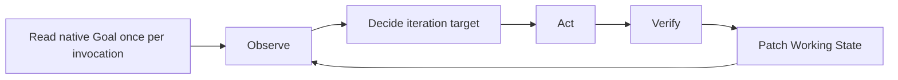

# Codex Goal Loop

Use a structured contract for goal semantics and the native Codex Goal for lifecycle. Keep the objective and acceptance conditions stable while evidence, hypotheses, and implementation approach evolve.

## Authority

- `Protected Goal` in the referenced contract is the sole authority for its display title, L0 Objective, L1 Acceptance Criteria, constraints, and non-goals.
- The native Codex Goal is the sole authority for goal identity, lifecycle status, budget, and usage.
- `Working State` is a replaceable evidence checkpoint. It must not contain a parallel lifecycle status.
- Current observable repository and external state override stale checkpoint claims.

## Invariants

- Never reinterpret or autonomously edit L0 or L1. Propose an exact refinement with evidence and wait for explicit user approval.
- Freely change the L2 approach and current iteration target when verification produces new facts.
- Every action must reduce a material uncertainty or measurably advance an Acceptance Criterion.
- Mark a criterion verified only with observable evidence. Record its locator, observation time, and invalidation conditions; re-verify it when later changes or time-sensitive facts invalidate it.
- A failed approach is evidence and does not by itself justify a blocked transition.
- Context reset and execution-budget exhaustion are handoffs, not blockers.
- Do not revert or overwrite changes that cannot be attributed to the current goal.

## Native Goal Contract

Use the available native Goal operations according to their current tool contract:

- Read the Goal with `get_goal` before starting or resuming work.
- Call `create_goal` only after an explicit user request. An explicit `$codex-goal-loop <intent>` invocation counts; automatic Skill selection and `$codex-goal-loop` without an objective do not.
- Pass a token budget only when the user explicitly requests one.
- Use `update_goal` only for a justified `complete` or `blocked` transition.
- Leave `/goal edit`, `/goal pause`, `/goal resume`, and `/goal clear` to the user or host. Do not emulate them in the contract.

If native Goal state cannot be read, stop before creating, reading, or mutating a contract.

The native objective must contain exactly one deterministic locator followed by a short execution clause:

```text
Contract: .goal/<title-datetime>.md

Pursue the referenced Protected Goal as the authoritative objective, acceptance
criteria, constraints, and non-goals. Continue until every acceptance criterion
has current observable evidence, then complete this Codex Goal. Do not change
Protected Goal without explicit user approval.
```

The `Contract:` value must be a normalized workspace-root-relative path with no glob, environment variable, or parent-directory escape. The resolved path must remain below the active workspace and exist before an iteration begins. A missing, ambiguous, absolute, or escaping locator is an authority failure: stop and request restoration or `/goal edit`; never reconstruct the contract from memory.

## Start Or Resume

### Start An Explicit Goal

1. Read native Goal state. Do not create a second unfinished Goal.
2. Select the contract location:
   - Default same-workspace mode: use `.goal/<title-datetime>.md`, with a short lowercase hyphenated title and local `YYYYMMDD-HHmmss` time. Ensure the workspace-root `.gitignore` contains `/.goal/` and verify the path is ignored before writing.
   - Explicit cross-machine, fresh-clone, or cloud mode: obtain approval for a workspace-root-relative tracked project-document path. Do not ignore, commit, or publish it automatically.
3. Investigate enough context to distinguish facts, assumptions, acceptance conditions, constraints, and non-goals.
4. If a material ambiguity changes scope or success, present the proposed contract and request the missing decision.
5. Otherwise read [`references/goal-template.md`](references/goal-template.md):
   - When the user explicitly identifies an existing legacy contract, validate and reuse that file rather than creating a duplicate.
   - For a new contract, create it at the selected location and initialize Working State from observed facts.
6. Create the native Goal with the exact `Contract:` locator and execution clause.
7. Re-read the native Goal and contract before beginning the first iteration.

If native Goal creation fails after writing the contract, retain it as an unlinked draft, report the exact failure, and do not start the loop. A later explicit retry must reuse or explicitly supersede that draft.

### Handle Existing Goal State

- No Goal: continue Start An Explicit Goal only when creation was explicitly requested.
- Active Goal: resolve it through the locator branches below.
- Paused or blocked Goal: stop and report the last observed status and native user action required to resume. Do not iterate through that boundary.
- Complete Goal: treat it as finished. A new explicit goal request may start another Goal.

For an active Goal:

- One valid locator to an existing contract: resume it.
- A missing or invalid contract: stop and request restoration or `/goal edit`.
- No locator, but the native objective matches the requested intent: draft the contract, obtain approval, and ask the user to install its locator with `/goal edit` before resuming.
- No locator with different intent, or a locator to another valid contract: stop and ask the user to continue, complete, pause, or clear that Goal.

### Resume

1. Read the native Goal once at the start of the invocation.
2. Resolve exactly one valid `Contract:` locator.
3. Read Protected Goal and Working State completely.
4. Re-observe relevant repository, tools, and external state.
5. Reconcile checkpoint claims using evidence and each criterion's invalidation conditions.
6. Choose the smallest highest-value iteration that advances an unverified criterion or removes a material uncertainty.

Default `.goal/` contracts are local and resume only while the same workspace data exists. A native lifecycle handle does not make a missing local contract portable.

## Contract And Checkpoint

Read [`references/goal-template.md`](references/goal-template.md) when creating a contract, restoring required sections, migrating a legacy file, or applying an approved refinement. Routine resumes use the existing file.

During ordinary iterations, patch only Working State. Keep concise evidence summaries and locators rather than transcripts. Do not duplicate L0/L1 wording inside Working State.

When an approved contract refinement is applied:

1. Update only the approved Protected Goal fields.
2. Invalidate every affected acceptance-evidence entry.
3. Leave the native objective unchanged because it points to the contract.

For a legacy file with `Working State > Status`, ignore that field for lifecycle decisions. Remove it on the next meaningful checkpoint only after the native Goal successfully references the file.

## Workflow



- Prefer one primary iteration target at a time and name the criterion or uncertainty it advances.
- Treat failed verification as evidence: change the hypothesis, approach, or next action.
- Do not repeat an unchanged action without new evidence.
- If work drifts from L0/L1, stop it, inspect its changes, remove only unnecessary changes known to belong to this goal when safe, then re-observe.

## Native Lifecycle

### Continue

When another authorized action can advance the goal, leave the native Goal active, patch Working State, and name the next action. Do not persist `CONTINUE`.

### Blocked

Report an authority boundary or unavailable required input immediately. Call `update_goal({ status: "blocked" })` only when the current native tool contract permits it. Until then, leave the Goal active, record the exact request under `Pending External Decision`, and report what is needed.

Use the unchanged pending-decision text as evidence that the same blocker persists across Goal turns; do not store a separate counter. Do not persist `BLOCKED`.

### Complete

Call `update_goal({ status: "complete" })` only when:

- Every L1 criterion has current observable evidence.
- Relevant existing normal paths remain valid.
- For each criterion, the strongest realistic falsifying observation has been identified and checked when accessible.
- Every validation command explicitly required by Protected Goal has succeeded.

After native completion succeeds, report final status and usage returned by the tool. Do not persist `DONE`.

## Handoff

Report:

```md
Native Goal as last observed: active | paused | blocked | complete
Contract: <workspace-relative-path>
Acceptance: verified and unverified criterion IDs
Evidence: most important current observations
Pending decision: exact external input required, if any
Next: next action, required decision, or completion statement
```

## Responsibility Boundary

- The agent owns Goal alignment, Observe, Decide, Act, Verify, contract content after user approval, and Working State checkpoints.
- Native Codex Goal owns lifecycle, budget, and usage state.
- The user or host owns objective edits, pause, resume, clear, invocation, and context reset.
- The host may preserve native Goal state but must not choose the L2 approach or declare Acceptance Criteria verified.

## Boundaries

- Do not turn the Skill into a scheduler, wake-up system, or lifecycle runner.
- Do not create separate goal revisions, event ledgers, subgoal trees, locks, automatic commits, or local lifecycle counters without evidence that the simple design fails.
- Do not treat plans, documentation, tests, prior claims, or Working State as unquestionable truth.

## Quality Standard

When evidence invalidates the first approach, keep Protected Goal unchanged, record the failure, choose a new L2 approach, and leave the native Goal active rather than declaring it blocked.
