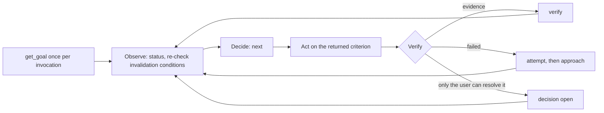

# Codex Goal Loop

Use one JSON contract for goal semantics and evidence state, `scripts/goal.py` for every contract transition, and the native Codex Goal for lifecycle. Keep the objective and acceptance criteria stable while evidence, approaches, facts, and risks evolve.

## Authority

- `protected` in the referenced contract is the sole authority for the objective, acceptance criteria, constraints, non-goals, and `max_attempts`. The title is display metadata.
- The native Codex Goal is the sole authority for goal identity, lifecycle status, budget, and usage.
- `working` stores facts only: current approach, steps, failed attempts, evidence, risks, and decisions. Criterion state (open, blocked, exhausted, verified) is derived by the script and never stored. No native lifecycle status is stored.
- [`schemas/goal.schema.json`](schemas/goal.schema.json) plus the invariants in `scripts/goal.py` are the sole authority for contract shape. A contract the script rejects is not a contract.
- Current observable repository and external state override stale checkpoint claims.

## Invariants

- Read and mutate the contract only through `scripts/goal.py`. Never hand-edit the JSON.
- Preserve `protected`. Change any part of it only through a refinement decision the user approved, applied by `decision resolve --approve`.
- Open a refinement decision when evidence contradicts a criterion or shows that no authorized action can satisfy it.
- Every action must advance the criterion returned by `next`.
- Mark a criterion verified only with observable evidence: a summary, a locator where it can be re-observed, and at least one invalidation condition. `verify` refuses while any step of that criterion is undone; close or drop each step explicitly.
- Break a criterion into `steps` whose text names something re-observable: a command, a file, or an id list, never "continue". The next step is derived, not stored.
- On every resume, re-check each verified criterion against its invalidation conditions and current state. Run `invalidate` when a condition has occurred. Re-observe what the first undone step points to before acting on it; drop steps the workspace shows are already done or no longer needed.
- Record a failed approach with `attempt` before choosing a new one. Failure alone does not justify a blocked transition.
- After `max_attempts` failed approaches on one criterion (default 10, stored in `protected`), the script refuses new approaches. Open a refinement or input decision instead of trying again; an approved decision on that criterion restores its attempt budget.
- Treat context reset and execution-budget exhaustion as handoffs rather than blockers.
- Do not revert or overwrite changes that cannot be attributed to the current goal.

## Native Goal Gates

Use native Goal operations according to their current tool contract:

- Read native Goal state with `get_goal` before starting or resuming work.
- Call `create_goal` only after an explicit user request.
- Treat an explicit `$codex-goal-loop <intent>` invocation as a creation request.
- Automatic Skill selection does not authorize `create_goal`.
- `$codex-goal-loop` without an objective does not authorize `create_goal`.
- Pass a token budget only when the user explicitly requests one.
- Use `update_goal` only for a justified `complete` or `blocked` transition.
- Leave `/goal edit`, `/goal pause`, `/goal resume`, and `/goal clear` to the user or host.
- Never emulate native Goal lifecycle operations inside the contract.
- Stop before reading or mutating a contract when native Goal state cannot be read.
- Store exactly one deterministic contract locator and one execution clause in the native objective. `init` prints both.

## Workflow



- Observe: run `status`, re-observe repository and external state, `invalidate` evidence whose invalidation condition occurred, and `risk` to add or drop open risks.
- Decide: `next` names the single criterion to pursue and its first undone step, or reports that decisions are pending or completion is ready. Set or change the approach with `approach`; list the remaining work with `step add`.
- Act: do the first undone step of that criterion only, then `step done`.
- Verify: `verify` with evidence, `attempt` with the observed failure, or `decision open` when only the user can resolve the blocker.
- The script rejects an approach the contract already records as failed. Change the hypothesis before retrying.
- Complete: `ready` exits 0 only when every criterion is verified and no decision is open. Check each listed falsifier that is within current authority, then call `update_goal({ status: "complete" })`.

## Reference Router

- Read [`references/workflow.md`](references/workflow.md) before starting, resuming, changing native lifecycle state, or handing off a Goal.
- Run `python3 <skill-root>/scripts/goal.py <command> --help` for exact arguments.
- Read [`schemas/goal.schema.json`](schemas/goal.schema.json) only when a validation error needs interpretation.

## Responsibility Boundary

- The agent owns Goal alignment, Observe, Decide, Act, Verify, evidence judgments, and every script invocation.
- `scripts/goal.py` owns contract validation, criterion and decision transitions, next-step selection, and completion readiness.
- Native Codex Goal owns lifecycle, budget, and usage state.
- The user or host owns objective edits, decision outcomes, pause, resume, clear, invocation, and context reset.
- The host may preserve native Goal state.
- The host must not choose an approach or declare a criterion verified.

## Boundaries

- Do not turn the Skill into a scheduler, wake-up system, or lifecycle runner.
- Do not add fields, sidecar files, event ledgers, subgoal trees, locks, automatic commits, or lifecycle counters outside the schema.
- Do not treat plans, documentation, tests, prior claims, or `working` as unquestionable truth.
- Do not reconstruct a missing or invalid contract from memory.

## Quality Standard

Requires Python 3.10+ and the `jsonschema` package. Resolve `<skill-root>` to this skill directory.

```bash
python3 <skill-root>/scripts/goal.py validate <contract>
python3 -m unittest discover -s <skill-root>/tests -v
```

When evidence invalidates an approach:

1. Keep `protected` unchanged.
2. Record the failure with `attempt`.
3. Choose a new approach with `approach`.
4. Leave the native Goal active unless the native blocked contract is satisfied.
