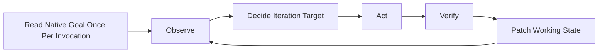

# Goal Workflow

Apply the authority and invariants in [`SKILL.md`](../SKILL.md) throughout this workflow.

## Native Objective And Locator

Store this structure in the native objective:

```text
Contract: .goal/<title-datetime>.md

Pursue the referenced Protected Goal as the authoritative objective, acceptance
criteria, constraints, and non-goals. Continue until every acceptance criterion
has current observable evidence, then complete this Codex Goal. Do not change
Protected Goal without explicit user approval.
```

- Locator format: Use one normalized workspace-root-relative path without globs, environment variables, or parent-directory escapes.
- Locator boundary: Keep the resolved path below the active workspace.
- Iteration precondition: Confirm that the resolved contract exists.
- Contract-validity precondition: Confirm that the resolved contract contains a non-empty L0 Objective and at least one identified L1 Acceptance Criterion.
- Authority-failure condition: The native objective contains at least one locator but does not resolve exactly one normalized, workspace-contained, existing contract.
- Authority-failure action: Stop Goal execution.
- Authority-failure request: Request contract restoration or `/goal edit`.
- Protected-Goal-damage condition: The resolved contract fails the contract-validity precondition.
- Protected-Goal-damage action: Stop Goal execution.
- Protected-Goal-damage request: Request contract restoration or `/goal edit`.
- Working-State-damage condition: The resolved contract satisfies the contract-validity precondition and a required Working State section is missing.
- Working-State-damage action: Restore the missing sections from [`goal-template.md`](goal-template.md) and record every acceptance entry without current evidence as `UNVERIFIED`.
- Prohibition: Never reconstruct the contract from memory.

## Route Native Goal State

Read native Goal state once at the start of the invocation.

- No-Goal condition: No unfinished native Goal exists.
- No-Goal action: Start a Goal only when the user explicitly requested creation.
- Active-Goal condition: The native Goal is active.
- Active-Goal action: Resolve the contract through the locator branches in this workflow.
- Paused-or-blocked condition: The native Goal is paused or blocked.
- Paused-or-blocked action: Stop Goal execution.
- Paused-or-blocked report: Report the last observed status and the native user action required to resume.
- Paused-or-blocked prohibition: Do not run an iteration.
- Complete-Goal condition: The native Goal is complete.
- Complete-Goal action: Treat the native Goal as finished.
- New-Goal condition: The user makes a new explicit creation request.
- New-Goal action: Start another Goal.

## Start An Explicit Goal

- Start condition: No unfinished native Goal exists and the user explicitly requested Goal creation.
- Local-contract condition: The user did not request cross-machine, fresh-clone, or cloud use.
- Local-contract path: Use `.goal/<title-datetime>.md` with a short lowercase hyphenated title and local `YYYYMMDD-HHmmss` time.
- Local-contract ignore rule: Ensure the workspace-root `.gitignore` contains `/.goal/`.
- Local-contract precondition: Verify that the contract path is ignored before writing.
- Tracked-contract condition: The user explicitly requires cross-machine, fresh-clone, or cloud use.
- Tracked-contract approval gate: Obtain approval for a workspace-root-relative tracked project-document path.
- Tracked-contract ignore prohibition: Do not automatically ignore the tracked contract.
- Tracked-contract commit prohibition: Do not automatically commit the tracked contract.
- Tracked-contract publish prohibition: Do not automatically publish the tracked contract.
- Contract investigation: Distinguish verified facts, assumptions, acceptance conditions, constraints, and non-goals.
- Ambiguity condition: A missing decision changes Goal scope or success.
- Ambiguity action: Present the proposed contract and request the missing decision.
- Contract creation condition: No missing decision changes Goal scope or success.
- Template action: Read [`goal-template.md`](goal-template.md).
- Contract creation action: Create the contract at the selected path.
- Working State initialization: Initialize Working State from observed facts.
- Native creation action: Call `create_goal` with the exact `Contract:` locator and execution clause.
- Native Goal verification: Re-read the native Goal before beginning the first iteration.
- Contract verification: Re-read the contract before beginning the first iteration.
- Creation-failure condition: Native Goal creation fails after the contract is written.
- Creation-failure action: Retain the contract as an unlinked draft.
- Creation-failure report: Report the exact failure.
- Creation-failure prohibition: Do not begin an iteration.
- Retry condition: A later explicit creation request matches an unlinked draft.
- Retry action: Reuse the matching draft.
- Supersede condition: The requested Goal cannot use the matching draft.
- Supersede action: Obtain explicit user approval before superseding the draft.

## Resolve An Active Goal

- Resume condition: The native objective contains exactly one valid locator to an existing contract, and the invocation does not request a different Goal.
- Resume action: Resume with that contract.
- Invalid-contract condition: The Authority-failure condition in Native Objective And Locator applies.
- Invalid-contract action: Stop Goal execution.
- Invalid-contract request: Request restoration or `/goal edit`.
- Matching-intent condition: The native objective has no locator and matches the requested intent.
- Matching-intent action: Draft the contract.
- Matching-intent approval gate: Obtain user approval for the contract.
- Matching-intent handoff: Ask the user to install the approved locator with `/goal edit` before resuming.
- Conflicting-intent condition: The native objective has no locator and a different intent, or the resolved contract belongs to a Goal other than the one requested by the invocation.
- Conflicting-intent action: Stop Goal execution.
- Conflicting-intent request: Ask the user to continue, complete, pause, or clear the existing Goal.

## Resume

1. Resolve exactly one valid `Contract:` locator.
2. Read Protected Goal and Working State completely.
3. Re-observe relevant repository, tool, and external state.
4. Reconcile checkpoint claims against current evidence and each criterion's invalidation conditions.
5. Choose one iteration that advances one unverified Acceptance Criterion or resolves one named uncertainty that blocks verification.

Default `.goal/` contracts resume only while the same workspace data exists. A native lifecycle handle does not make a missing local contract portable.

## Contract And Working State

- Patch only Working State during ordinary iterations.
- Keep evidence summaries and locators instead of transcripts.
- Do not duplicate L0 or L1 wording inside Working State.
- Preserve evidence that remains valid under its invalidation conditions.
- Re-verify evidence affected by an invalidation condition or changed time-sensitive fact.
- Record no raw private data in the contract.
- Record a proposed L0 or L1 refinement under `Pending External Decision` until the user approves or rejects it.

When applying an approved contract refinement:

1. Update only the approved Protected Goal fields.
2. Invalidate every affected acceptance-evidence entry.
3. Leave the native objective unchanged because it points to the contract.

## Iteration Loop



- Use one primary iteration target at a time.
- Name the Acceptance Criterion or uncertainty advanced by the iteration.
- Treat failed verification as evidence.
- Change the hypothesis, approach, or next action after failed verification.
- Do not repeat an unchanged action without new evidence.

When work drifts from L0 or L1:

1. Stop the drifting work.
2. Inspect its changes.
3. Remove only unnecessary changes attributable to the current Goal whose removal does not overwrite or discard unrelated work.
4. Re-observe the affected state.

## Native Lifecycle

### Continue

- Transition condition: Another authorized action can advance the Goal.
- Native action: Leave the native Goal active.
- Working State action: Patch the current evidence and next action.
- Report action: Name the next action.
- Prohibition: Do not persist `CONTINUE`.

### Blocked

- Report condition: An authority boundary or unavailable required input prevents progress.
- Immediate action: Report the exact missing authority or input.
- Native transition condition: The current native Goal tool contract permits `blocked`.
- Native transition action: Call `update_goal({ status: "blocked" })`.
- Active-state condition: The native blocked transition is not yet permitted.
- Active-state action: Leave the native Goal active.
- Working State action: Record the exact request under `Pending External Decision`.
- Persistence evidence: Use unchanged pending-decision text as evidence that the same blocker persists across Goal turns.
- Counter prohibition: Do not store a separate blocker counter.
- Status prohibition: Do not persist `BLOCKED`.

### Complete

Call `update_goal({ status: "complete" })` only when every completion condition passes:

- Every L1 Acceptance Criterion has current observable evidence.
- Every normal path affected by the Goal has current verification evidence.
- For each criterion, identify an observation that would contradict its evidence if present.
- Check the falsifying observation when its required source or tool is available within current authority.
- Every validation command explicitly required by Protected Goal has succeeded.

After native completion succeeds:

- Report the final status and usage returned by the tool.
- Do not persist `DONE`.

## Handoff

At the end of every invocation, report:

```md
Native Goal as last observed: active | paused | blocked | complete
Contract: <workspace-relative-path>
Acceptance: verified and unverified criterion IDs
Evidence: most important current observations
Pending decision: exact external input required, if any
Next: next action, required decision, or completion statement
```
