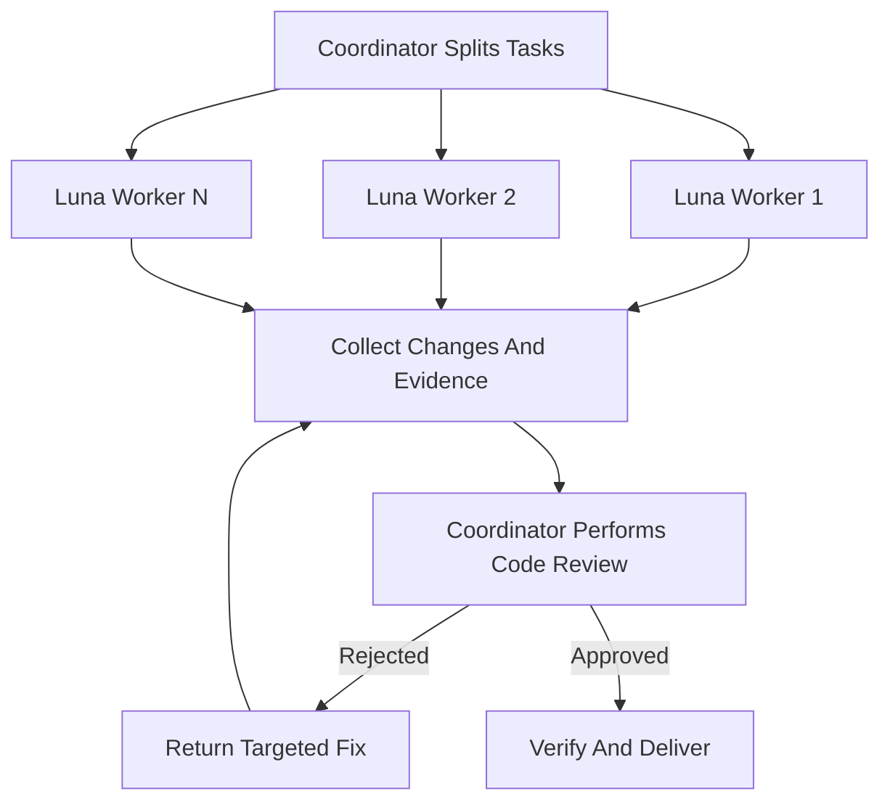

# Codex–Luna Swarm

Use one execution pattern: Luna workers investigate or implement in parallel, then the coordinator personally reviews the combined code before delivery. Parallelism provides speed; the coordinator review gate provides safety. Do not split these into separate modes.



## Responsibility Boundary

Use `coordinator` as the canonical name for the coordinating and reviewing actor. Use `Luna worker` as the canonical name for each delegated actor. Keep `agent tree` and `subagent` only for their runtime and tool meanings.

| Work | coordinator | Luna workers |
|---|---|---|
| Initial investigation | Perform the minimum investigation needed to define the problem and scope | Deepen independent lines of investigation |
| Code call paths | Define the boundary and verify critical paths | Investigate separate modules in parallel |
| External research needed by the coding task | Verify conclusions that affect decisions against authoritative sources | Investigate separate official sources or approaches |
| Root-cause decision | Make the final determination | Provide candidate causes and evidence |
| Code implementation | Implement directly or delegate | Act as the primary implementer |
| Tests and checks | Re-run and verify critical results | Run relevant checks first and report them |
| Code review | Perform it personally | Never substitute for the coordinator's review |
| Conflict resolution and delivery | Retain decision authority within the assigned Swarm | Do not make the final decision |

## Coordinator Configuration And Work Scope

The invoking host is the coordinator and must run `gpt-6-astra` with `medium` reasoning effort. Before assigning work, verify the effective session configuration from runtime metadata or an effective launch receipt supplied by the caller. A requested model, display name, or agent self-description is not verification. If configuration is incompatible or cannot be established, report the blocker; do not silently use another model or spawn a replacement coordinator from this Skill.

When working under a lead, the assigned team subgoal is this Swarm's work scope. The lead retains the shared goal, cross-team ownership decisions, and overall acceptance. The coordinator keeps responsibility for its own workers and personally performs Step 5; lead review does not replace coordinator review.

- Inherit the lead's team scope, exclusions, acceptance conditions, and reporting contract. Subdivide only within that authority, and escalate cross-team dependencies or requested ownership changes before affected writes.
- Report startup, decision-relevant progress, blockers, and the reviewed result to the lead through the supplied runtime channel. Worker reports go to the coordinator, not directly to the lead.
- When the coordinator is an Orca Dispatch, verify that its dispatch policy permits native Codex subagents before spawning. Native Luna workers are not Orca Dispatches and must not issue Orca lifecycle commands or `worker_done` for the coordinator. Only the coordinator reports its Dispatch completion after its workers settle and its own review is complete.
- Never invoke the lead's orchestration Skill, create another coordinator, or expand team completion into approval of the entire user goal.
- Outside a lead-managed run, the invoking coordinator retains standalone delivery responsibility for the user's assigned goal.

## Invariants

- Host-role binding: The host agent executing this Skill is the coordinator for the entire Swarm.
- Spawned-role restriction: Every subagent spawned while this Skill is active is a Luna worker.
- Review ownership: The host agent personally performs Step 5.
- Every Luna worker is spawned with `model: "gpt-5.6-luna"`, `reasoning_effort: "max"`, and `fork_turns: "none"`.
- Luna workers must not spawn subagents.
- Luna workers must not accept another Luna worker's code as reviewed.
- Every code change must pass the coordinator's direct review, including code the coordinator wrote or repaired itself. A Luna worker's summary, test result, or self-assessment cannot replace this gate.
- Every change in the integrated result must trace to the established goal, an acceptance condition, or a named uncertainty. A change that cannot be traced is rejected or reverted, not carried into delivery.
- When this Skill is invoked, the coordinator must evaluate the task against the Swarm condition in Step 1 before proceeding alone.
- Never invent work merely to increase the Luna worker count.
- The coordinator retains approval decisions for its own Swarm within the inherited authorization; a lead-managed run still requires the lead's overall acceptance.
- The coordinator applies the current authorization and safety boundaries to delegated work.
- Delegation must remain within the authorized scope.
- Keep this Skill active while work serves the same user-visible outcome, including repairs, validation, and review.
- The user does not need to repeat the Skill name while it remains active.
- Reuse an existing Luna worker when its assignment continues the same objective, owned files, or evidence path.
- Create a new Luna worker only for independent work or deliberate context isolation.
- Inspect the known and live agent tree before assigning work.
- Assign each work unit to one Luna worker.
- Never infer a missing Luna worker identity.
- Claim Luna worker continuity only when the known and live agent tree establishes the identity.
- A wait operation that returns no update does not change a running Luna worker's state.
- Continue waiting while a Luna worker remains running.
- Luna workers run at max reasoning effort and therefore take longer than ordinary delegated work: slowness or silence is expected execution, not a fault signal.
- Elapsed time alone must not justify prompting a running Luna worker for progress, pausing it, interrupting it, replacing it, or taking over its assignment.

## Workflow

### 1. Establish The Work

Before assigning Luna workers:

- State the user-visible goal, current behavior, constraints, acceptance conditions, and out-of-scope work from inspected evidence.
- Separate independent investigation, implementation, and verification units from work that depends on earlier findings.
- Swarm condition: At least two independent units can run concurrently without conflicting write ownership, and each unit advances an acceptance condition or resolves a named uncertainty.
- Swarm action: Assign each qualifying unit to a Luna worker.
- Direct-execution condition: No split satisfies the Swarm condition.
- Direct-execution action: The coordinator proceeds alone and states the concrete constraint.

### 2. Assign Independent Ownership

Give each Luna worker a bounded task packet:

```yaml
objective: one concrete outcome
facts: only the verified context needed for this task
scope: allowed files, components, or questions
write_owner: files this Luna worker alone may modify; empty means read-only
acceptance: observable conditions for success
exclusions: actions and areas outside authority
return: findings, sources when research was performed, changed files, validation, and unresolved risks
```

- Start with two to four Luna workers.
- Increase the Luna worker count only when more proven independent units remain unassigned.

- Shared-file condition: Two or more Luna workers may touch the same file.
- Shared-file action: Assign one Luna worker as the write owner and make the other Luna workers read-only for that file.
- Scheduling alternative: Run dependent write assignments sequentially.

- Assignment preparation: Inspect the known and live agent tree.
- Luna worker reuse condition: An existing Luna worker retains context needed by the assignment.
- Luna worker reuse action: Update that Luna worker's bounded task instead of creating a duplicate assignment.

### 3. Run Luna Workers

Use the collaboration subagent tool directly with:

```json
{
  "model": "gpt-5.6-luna",
  "reasoning_effort": "max",
  "fork_turns": "none"
}
```

- Spawn action: Send each Luna worker the complete bounded task packet because it receives no inherited conversation.
- Execution action: Run independent Luna worker assignments concurrently.
- Wait action: Wait for Luna worker results without busy polling.
- No-update action: Inspect the live agent state.
- Running-state action: Continue waiting. Max-effort execution is expected to take longer, so do not prompt a running Luna worker for a progress report or pause its assignment to check on it.
- Interrupt condition: The user requests interruption, the assignment leaves task scope, or continued execution would cross an authorization or safety boundary.
- Interrupt action: Interrupt the running Luna worker.
- Replacement condition: The prior Luna worker is no longer running and its assignment remains incomplete because it failed, reported that it cannot continue, or returned a partial result.
- Replacement action: Spawn a replacement Luna worker with a complete bounded task packet.
- Additional-worker condition: A proven independent unit remains unassigned.
- Additional-worker action: Spawn another Luna worker for that unit.
- Direct-execution condition: The remaining work does not satisfy the Swarm condition.
- Direct-execution action: The coordinator completes the remaining work and applies the integration, review, and validation gates.

### 4. Integrate Evidence And Changes

- Integration entry gate: Every required Luna worker outcome is complete or validly superseded.
- Supersede a required Luna worker outcome only when its assigned work is no longer part of the user-visible task.
- Recovery condition: A Luna worker is no longer running and its required outcome remains incomplete.
- Recovery action: Return the incomplete assignment to Step 3.
- Omission prohibition: Never omit an incomplete required outcome.
- Evidence collection: The coordinator reads every Luna worker result.
- Workspace inspection: The coordinator inspects the actual workspace.
- Evidence gate: Treat Luna worker summaries as claims until files, diffs, logs, or test output support them.

- Reconcile contradictory Luna worker results.
- Reject out-of-scope edits and unexplained files.
- Resolve integration at the authoritative source.
- Never preserve duplicate implementations as an integration shortcut.
- Request rework only when review produces concrete new evidence.
- Never repeat an unchanged failed instruction.

### 5. Coordinator Code Review Gate

The coordinator personally reviews the combined result before declaring success:

1. Inspect the complete diff and map each change to the confirmed goal or root cause.
2. Read the changed logic in its caller, callee, state, and error-propagation context.
3. Look adversarially for incorrect assumptions, write conflicts, duplicate rules, hidden fallbacks, scope expansion, and regressions.
4. Run the available tests, type checks, builds, and lint that cover the changed behavior and affected paths.
5. Confirm the original problem is resolved and important normal paths still work.

- Self-authored condition: The coordinator implemented or repaired part of the change itself.
- Self-authored action: Put that code through this same gate. Knowing the intent behind a change is not evidence that it is correct, so read it as adversarially as delegated code and state that it was self-reviewed.
- Review-failure action: The coordinator identifies a concrete defect and acceptance condition.
- Untraceable-change action: The coordinator rejects or reverts the change instead of carrying it into delivery.
- Luna worker repair condition: The prior Luna worker's context is needed for the repair.
- Luna worker repair action: Send the focused repair to that Luna worker.
- coordinator repair condition: The repair does not need Luna worker context and remains within the coordinator's existing authority.
- coordinator repair action: The coordinator fixes the defect directly.
- Stop condition: Further progress requires guessing or new authorization.
- Stop action: Stop and report the required evidence or authorization.
- Re-entry gate: Every repair returns to Step 4 and passes the complete coordinator review and validation gate before delivery.

### 6. Deliver

The final response must identify:

- how work was divided and which Luna workers changed files;
- what the coordinator found during its own code review;
- evidence that the original problem and normal paths were verified;
- tests and checks run, including failures or omissions;
- unresolved assumptions, risks, and unrelated findings.

Only the coordinator can declare its assigned Swarm ready for delivery. In a lead-managed run, submit the reviewed result to the lead for acceptance; do not mark the shared user goal complete. In a standalone run, the coordinator owns final delivery.

## Boundaries

- Do not build a DAG engine, voting system, consensus layer, persistent memory, role registry, or recursive hierarchy unless a demonstrated failure requires it.
- Do not create a persistent session registry or duplicate lifecycle state to preserve Luna worker continuity.
- Do not let Luna worker count substitute for task decomposition or evidence quality.
- Do not ask multiple Luna workers to make competing edits in the shared workspace.
- Do not treat passing tests as sufficient code review.
- Do not commit, push, deploy, publish, delete, or perform irreversible actions unless the user has separately authorized them.

## Quality Standard

A successful run meets all of these conditions:

- Independent Luna worker assignments provide real parallel execution.
- No concurrent write ownership conflict remains.
- The coordinator independently inspects the integrated code and verification evidence before delivery.
