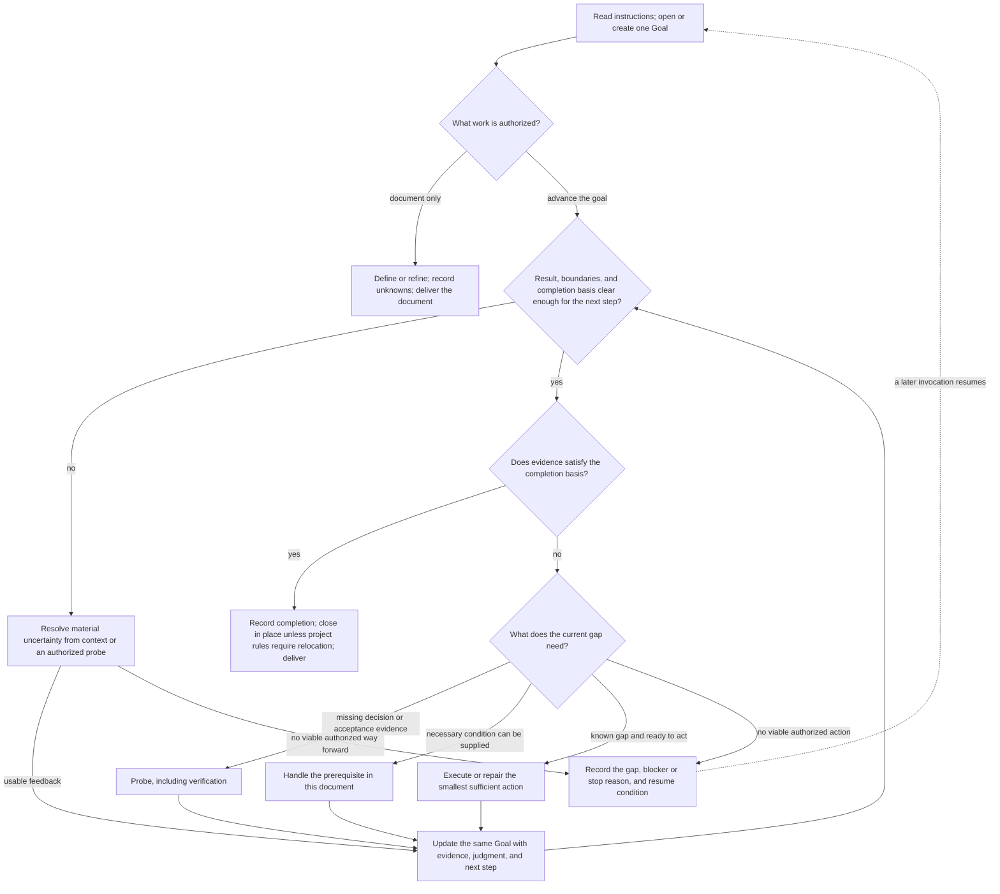

# Define Goal

One goal, one document. Record the user result, boundaries, completion basis, current judgment,
next action, and evidence. The document is the persistent record; conversation is a temporary
working context. Do not create child goals, duplicate records, or a second task-state system.

## Document Contract

- Path: `<dir>/YYYYMMDD-<title>.md`. Use the user-specified directory; otherwise use `docs/goals/`
  at the project root, identified by the nearest ancestor containing `.git` or the project's
  entry file. If no root can be identified, use `docs/goals/` in the current directory.
- Use the actual creation date in the project's timezone, or UTC when none is specified.
  Choose a short, filesystem-safe title and keep the filename. Reuse the same goal's existing
  document; for a different goal with a colliding name, choose a distinguishing title. Never overwrite.
- Read applicable project instructions and the user-specified or matching Goal before acting.
  If no document exists, read [the Goal template](references/goal-template.md) and create it
  before substantive action. Create directories as needed; adapt the template to the task.
- Distinguish **define or refine the document** from **advance the underlying goal**. Do only
  the requested work; a Goal records authorization, never grants it. Do not widen scope or
  lower acceptance criteria to make the result pass.
- On resume, verify relevant real state, especially whether an intended side-effecting action
  already ran. Preserve concurrent edits. If the Goal cannot be written or updated, stop
  dependent work and report the persistence blocker; chat is not a substitute.

## Evidence-Driven Workflow

These are choices, not phases. Verification is a probe; repair is execution supported by
failure evidence. An unverified outcome is not automatically an implementation defect.
Document-only delivery does not execute the underlying work or establish its completion.

## Operating Rules

**Establish enough to act.** Define the intended result, authorized scope, and observable
completion basis from the request and available context. Record unknowns instead of inventing
answers. Investigate resolvable uncertainty; a decision reserved for the user blocks only the
work that depends on it. Do not investigate unrelated unknowns before an otherwise justified action.

**Choose probes and prerequisites by need.** A probe answers a question that changes action,
risk assessment, or the completion verdict; use it before, during, or after execution.
A prerequisite supplies a condition needed by a particular path, not necessarily the whole goal.
Handle both in the same document and within authorization. Independent work may proceed while
another path is blocked. Parallelize only with real capacity and independent dependencies;
record actual owners, write scopes, outputs, and who coordinates the shared Goal record.

**Act, observe, update.** Record intent and expected feedback before important side effects;
then update actual results, judgment, and the next step promptly. A short plan is a revisable
choice, not a fixed task tree. Repeat a strategy only with new evidence, changed conditions,
or bounded retries justified by a failure model. An uninformative probe calls for a different
justified method, not an automatic stop; stop when no viable authorized path remains or an
applicable limit is reached. Scheduling, budgets, and re-invocation belong to the invoking runtime.

**Keep evidence usable.** Distinguish observation, inference, and unknown. Record the source,
relevant baseline, method, result, and coverage needed to interpret a claim. Mark checks as
passed, failed, blocked, or not run, and explain their effect on acceptance. Recheck evidence
affected by changed code, inputs, environment, or criteria; reuse unaffected valid evidence.
The Goal must explain its result and judgment without the chat. Durable reports and source
artifacts may hold detailed evidence and be consulted for verification; summarize key findings
and limitations in the Goal rather than copying reports or storing raw logs and secrets.

## Completion and Delivery

Close only when the intended result holds, currently applicable required checks satisfy the
recorded completion basis, and required artifacts actually exist. A command succeeding, a file
being edited, or an experiment ending is not sufficient. A failed earlier attempt or a negative
experimental finding does not automatically prevent completion: assess it against the stated
objective. Never treat a required acceptance condition that is unmet or unverified as satisfied.

- On completion, record actual results, acceptance evidence, material limitations, and the
  completion date. Set `Status: Closed` and `Completion: Met`; **keep the file in place by default**.
- If applicable project conventions require archiving or relocation, follow them, keeping the
  filename and a single record. Do not overwrite a destination; verify the actual location,
  content, and affected links. Report relocation failure separately from the outcome verdict.
- When completion is not established, keep `Status: In progress` and `Completion: Not met`, with the gap,
  next authorized action, or blocker/stop reason and resume condition. Ending a session or
  writing a Goal document does not establish completion of the underlying result.
- Deliver the real document path, completion verdict, and key evidence. Claim only operations
  and checks actually performed; unresolved acceptance gaps must remain explicit.
