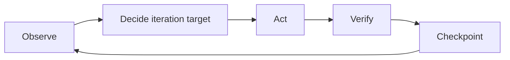

# Goal Loop

Keep an agent aligned with one durable goal while its approach, hypotheses, and next actions adapt to observable evidence. Long-running means the work may span multiple invocations; it does not require one unbounded context or a scheduler.

## Invariants

- Treat L0 Objective as immutable within the goal. Never change it autonomously.
- Treat L1 Acceptance Criteria as protected. Propose refinements with evidence and stop for external approval instead of silently changing success.
- Freely change the L2 approach and current iteration target when verification produces new facts.
- Every action must either reduce a material uncertainty or produce measurable progress toward an Acceptance Criterion.
- Mark an Acceptance Criterion verified only with current observable evidence. If later changes may affect it, mark it unverified and verify it again.
- Do not revert or overwrite changes that cannot be attributed to the current goal.

## Start Or Resume

### Start A Goal

1. Resolve the project workspace root.
2. Before creating goal state, ensure the root `.gitignore` contains the root-scoped rule `/.goal/`. Add it once when missing and verify that a path below `.goal/` is ignored. If this cannot be ensured, stop before writing goal state.
3. Create one file at `.goal/<title-datetime>.md`, where `title` is a short lowercase hyphenated summary and `datetime` uses local `YYYYMMDD-HHmmss` time.
4. Write the agreed Objective, Acceptance Criteria, constraints, and non-goals under `Protected Goal`. Initialize `Working State` from observed facts.
5. Keep the exact goal-file path for every later invocation.

### Resume A Goal

Resume only from an explicitly identified goal file. Read it completely, then re-observe the current workspace, available tools, and relevant external state before trusting the saved Working State. Observable reality overrides stale saved conclusions.

## Goal File

When starting a goal, restoring a malformed goal file, or applying an approved Goal Refinement, read [`references/goal-template.md`](references/goal-template.md). Routine resumes should use the existing goal file without loading the template.

`Protected Goal` is the sole authority for L0 and L1. `Working State` is a replaceable checkpoint, not a second source of truth and not an execution log. Store concise findings and evidence summaries; do not store secrets, credentials, personal data, or raw private logs.

## Workflow

Before each action, decide:

1. What is the current Objective and which Acceptance Criteria remain unverified?
2. What does the current evidence prove?
3. What is the largest relevant uncertainty or gap?
4. What is the smallest highest-value iteration target and next action?
5. What observable result would verify that iteration?

Then run the loop:



- Prefer one primary iteration target at a time. It may be diagnostic or implementational, but it must name the Acceptance Criterion it advances or the material uncertainty it reduces.
- Treat failed verification as new evidence: re-observe and change the hypothesis, approach, or next action. An L2 implementation failure is not a reason to block.
- If a direction no longer contributes to L0 or L1, treat the drift as internal control correction rather than a task outcome: stop it, inspect the changes it produced, remove only unnecessary changes that are known to belong to the current goal and are safe to recover, then re-observe.
- Do not repeat an unchanged action without new evidence. A failed iteration must add a fact or change the hypothesis, approach, or next action.
- After meaningful verification, and before any context or execution-budget handoff, patch only `Working State`; do not rewrite `Protected Goal`.

## Decide The Outcome

Return exactly one task outcome:

### CONTINUE

Use when another authorized action can reduce uncertainty or advance an Acceptance Criterion. Persist the current checkpoint and name the next best action. Context reset or budget exhaustion is a handoff, not a blocker.

### BLOCKED

Use only when the next required step crosses an authority boundary: an unavailable necessary input, an external business decision, or a conflict between L0/L1 and observed constraints. Record the evidence, affected criterion, proposed refinement when relevant, and the exact external decision needed in `Working State`. Do not modify `Protected Goal` until approval is explicit.

If L0 itself must change, request an external decision; never reinterpret or replace the Objective autonomously.

### DONE

Use only when every Acceptance Criterion has current observable evidence and relevant existing normal paths remain valid. Update `Working State` with the final evidence before reporting completion.

## Handoff

At an invocation boundary, report:

```md
Goal file: .goal/<title-datetime>.md
Outcome: CONTINUE | BLOCKED | DONE
Acceptance: verified and unverified criterion IDs
Evidence: most important current observations
Next: next action, external decision needed, or completion statement
```

## Responsibility Boundary

- The agent owns Goal alignment, Observe, Decide, Act, Verify, and the content of each checkpoint.
- The runner or host owns invocation, execution budget, context reset, re-invocation, and stopping after `BLOCKED` or `DONE`.
- The runner may preserve and pass the goal-file path, but must not choose the L2 approach or declare Acceptance Criteria verified. The agent must not absorb lifecycle control into a scheduler.

## Boundaries

- Do not turn the Skill into a scheduler, wake-up system, or lifecycle runner; those concerns remain outside the goal-iteration loop.
- Do not create separate state files, goal revisions, event ledgers, subgoal trees, locks, automatic commits, or retry counters without evidence that the simple design fails.
- Do not treat plans, documentation, prior claims, or prior Working State as unquestionable truth; reconcile them with observable evidence and the protected goal.

## Quality Standard

Given a goal whose first approach is invalidated by new observable evidence, the skill must keep L0/L1 unchanged, record the failed approach as evidence, choose a new L2 approach, and return `CONTINUE` rather than `BLOCKED`.
