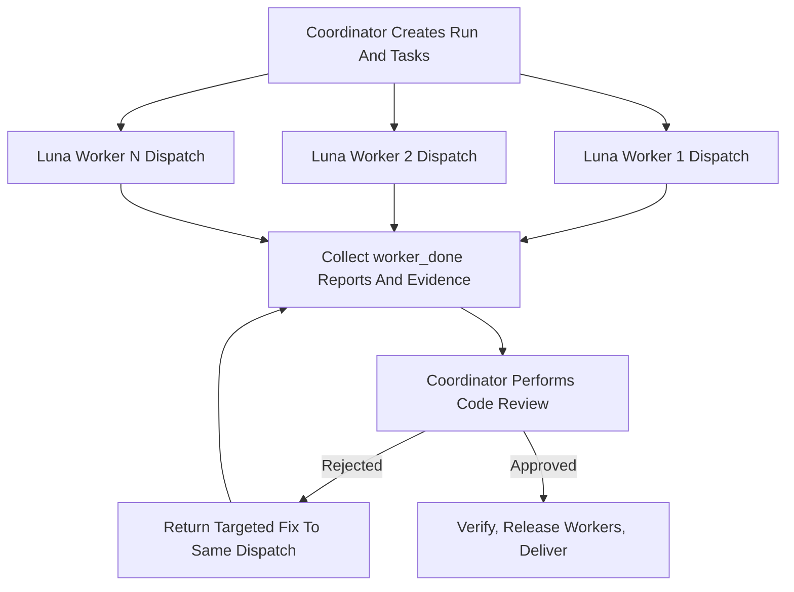

# Orca–Luna Swarm

Use one execution pattern: Luna workers investigate or implement in parallel as supervised Orca Dispatches, then the coordinator personally reviews the combined code before delivery. Parallelism provides speed; delegated investigation protects the coordinator's context; the coordinator review gate provides safety. Do not split these into separate modes.



## Runtime Boundary

This Skill owns the Swarm pattern. Orca owns the command surface.

- Load the live orchestration guide with `ORCA skills get orchestration` before running any Orca command, and resolve `ORCA` as that guide's own resolution rule requires.
- Never reproduce Orca subcommands or flags from memory or from this file. They change between Orca releases; this file names only stable concepts and one explicitly labeled fallback composition.
- Confirm the runtime is reachable before assigning work.
- Run every Luna worker through Orca supervised orchestration: a bound Run, one Task per work unit, and one Dispatch per Luna worker.
- Never substitute a non-Orca subagent tool, generic agent-spawn API, or chat-only parallel worker feature. Those create workers without Orca task and dispatch provenance, injected lifecycle preambles, `worker_done` authority, or decision gates.
- Handoff exclusion: Invoking this Skill is an explicit request to supervise, wait for worker completion, and coordinate. Do not reclassify it as a full ownership handoff, and do not drop supervision because the user's wording resembles a handoff.
- Provenance gate: Before describing a Luna worker as orchestrated, verify its Task and Dispatch exist in Orca state. If work ran outside Orca orchestration, say so plainly and rerun or revalidate it through a real Dispatch instead of relabeling it.

## Responsibility Boundary

Use `coordinator` as the canonical name for the coordinating and reviewing actor, which is always the invoking agent. Use `Luna worker` as the canonical name for each delegated actor. Keep `Run`, `Task`, `Dispatch`, `terminal`, and `worktree` only for their Orca runtime meanings.

| Work | Coordinator | Luna workers |
|---|---|---|
| Initial investigation | Perform the minimum investigation needed to define the problem and scope | Deepen independent lines of investigation |
| Noisy investigation | Delegate it and work from the distilled result | Absorb the reading, logs, and dead ends |
| Code call paths | Define the boundary and verify critical paths | Investigate separate modules in parallel |
| External research needed by the coding task | Verify conclusions that affect decisions against authoritative sources | Investigate separate official sources or approaches |
| Root-cause decision | Make the final determination | Provide candidate causes and evidence |
| Code implementation | Implement directly or delegate | Act as the primary implementer |
| Tests and checks | Re-run and verify critical results | Run relevant checks first and report them |
| Code review | Perform it personally | Never substitute for the coordinator's review |
| Orca lifecycle | Own the Run, Dispatches, waits, and worker release | Send `worker_done` once and then idle |
| Conflict resolution and delivery | Retain final decision authority | Do not make the final decision |

## Invariants

- Coordinator binding: The agent that invokes this Skill is the coordinator for the entire Swarm.
- Model independence: The coordinator role belongs to the invoking agent, not to a model. Never require a particular coordinator model. Never spawn or delegate to a separate coordinator or reviewer; this Skill deliberately keeps one accountable reviewer rather than adding an independent one.
- Spawned-role restriction: Every Luna worker is one supervised Orca Dispatch created while this Skill is active.
- Review ownership: The coordinator personally performs Step 5.
- Every Luna worker requests the GPT-5.6 Luna model at max reasoning effort, and the coordinator confirms the effective launch from the start receipt.
- Luna workers must not dispatch sub-workers. Orca's nested worker depth is normally one generation; a worker that hits that limit completes its own task instead of routing around it.
- Luna workers must not accept another Luna worker's code as reviewed.
- Every code change must pass the coordinator's direct review, including code the coordinator wrote or repaired itself. A Luna worker's report, test result, or self-assessment cannot replace this gate.
- Review labor is never delegated. The coordinator reviews its own work under the same adversarial standard instead of routing it to another reviewer.
- When this Skill is invoked, the coordinator must evaluate the task against the Swarm condition in Step 1 before proceeding alone.
- Never invent work merely to increase the Luna worker count.
- The coordinator retains every approval decision.
- The coordinator applies the current authorization and safety boundaries to delegated work.
- Delegation must remain within the authorized scope.
- Keep this Skill active while work serves the same user-visible outcome, including repairs, validation, and review.
- The user does not need to repeat the Skill name while it remains active.
- Reuse an existing Luna worker's terminal when its assignment continues the same objective, owned files, or evidence path.
- Create a new Luna worker only for independent work or deliberate context isolation.
- Inspect live Orca task, dispatch, and terminal state before assigning work.
- Assign each work unit to one Task and one Luna worker.
- Never infer a missing Luna worker identity. Claim continuity only when live Orca state establishes the Dispatch.
- A wait that returns no message is a checkpoint, not a Luna worker failure.
- Continue rolling waits while a Luna worker remains alive. Heartbeats and terminal activity prove liveness, not completion.
- Elapsed time alone must not justify stopping, releasing, replacing, or taking over a Luna worker.
- Accept or reject each Luna worker's own result before deciding whether to release it. Releasing a settled Luna worker closes its terminal and discards the context a repair would need.
- Account for every settled Luna worker before waiting again or ending the turn.

## Workflow

### 1. Establish The Work

Before assigning Luna workers:

- State the user-visible goal, current behavior, constraints, acceptance conditions, and out-of-scope work from inspected evidence.
- Separate independent investigation, implementation, and verification units from work that depends on earlier findings.
- Swarm condition: At least two independent units can run concurrently without conflicting write ownership, and each unit advances an acceptance condition or resolves a named uncertainty.
- Swarm action: Assign each qualifying unit to a Luna worker.
- Direct-execution condition: No split satisfies the Swarm condition.
- Direct-execution action: The coordinator proceeds alone and states the concrete constraint.

Delegate noisy investigation so the coordinator's context stays clean:

- Research-delegation condition: Producing the answer would generate far more noise than the answer itself, such as reading many files to find the few that matter, tracing a failure through long logs, surveying how a symbol is used repo-wide, or summarizing a large diff.
- Research-delegation action: Assign it as a read-only Luna worker whose `write_owner` is empty.
- Direct-reading condition: The coordinator already knows the two or three files it needs, one search answers the question, or it is about to edit the same material itself.
- Direct-reading action: The coordinator reads directly. Delegating material it will immediately edit forces a second read and saves nothing.
- Research-splitting condition: A question decomposes into sub-parts that need no shared intermediate findings.
- Research-splitting action: Assign one Luna worker per sub-part. Never fragment a single coherent question to raise the worker count.

### 2. Assign Independent Ownership

Give each Luna worker a bounded task packet as its Task spec. A Luna worker inherits no conversation, so the packet must stand alone:

```yaml
objective: one concrete outcome
facts: only the verified context needed for this task
scope: allowed files, components, or questions
write_owner: files this Luna worker alone may modify; empty means read-only
acceptance: observable conditions for success
exclusions: actions and areas outside authority
return: the direct answer or what changed; evidence coordinates as file paths and symbols; validation run; unresolved risks and surprises
```

- Return contract: Require a distilled result with its supporting evidence, not a transcript. Evidence coordinates must be precise enough to open directly, such as `src/session.rs:142` and `fn reconnect`.
- Start with two to four Luna workers.
- Increase the Luna worker count only when more proven independent units remain unassigned.

- Shared-file condition: Two or more Luna workers may touch the same file.
- Shared-file action: Assign one Luna worker as the write owner and make the other Luna workers read-only for that file.
- Scheduling alternative: Run dependent write assignments sequentially.

- Placement default: Run every Luna worker as a fresh agent terminal in the active worktree.
- New-worktree condition: The user explicitly requests one, or a concrete checkout or filesystem conflict makes sharing unsafe. Parallelism and convenience are not isolation requirements.
- New-worktree action: State the conflict before creating the worktree, choose child or top-level lineage deliberately, and run the repository's configured setup.

- Assignment preparation: Inspect live Orca task, dispatch, and terminal state.
- Luna worker reuse condition: A settled Luna worker retains context needed by the next assignment.
- Luna worker reuse action: Start the next Task on that exact terminal so Orca transfers cleanup ownership, instead of creating a duplicate assignment.

### 3. Run Luna Workers

- Setup action: Create or bind the Run, then create every independent Task before starting any Luna worker.
- Launch action: Start all independent Luna workers before waiting on any of them.
- Model action: Request the `gpt-5.6-luna` model with max reasoning effort when starting a fresh Luna worker terminal. The model id is an opaque provider id and passes through unchanged.
- Launch-verification action: Read the start receipt and compare the effective launch against the request.
- Launch-mismatch condition: The receipt shows a different effective model or effort, or the runtime does not support launch preferences.
- Launch-mismatch action: Fall back to the custom-argv launch below, then confirm the effective argv. If neither path yields a verified Luna worker at max effort, stop and report it instead of delivering work from an unverified model.

The fallback composes two guide recipes that the guide documents separately: a terminal created with explicit Codex arguments, then attached to the Task as a supervised worker. The Orca command names below are placeholders whose exact flags come from the live guide; only the Codex arguments are stable, because they belong to Codex rather than to Orca.

```text
# 1. Create the terminal with Codex's own model and reasoning-effort arguments.
--command 'codex --model gpt-5.6-luna -c model_reasoning_effort="max"'
# 2. Attach that exact terminal to the Task as a supervised Luna worker.
orchestration worker-start --task <task_id> --terminal <handle>
```

- Supervision requirement: Attach the terminal through supervised worker start. Injecting a dispatch into an operator-started terminal leaves it unsupervised, which breaks worker lifecycle state and release accounting.
- Conflict rule: The live guide wins over anything written here. If it contradicts this fallback, follow the guide and report the difference.
- Failed-start action: A failed or unknown start reports its stage, effects, and residual resources. Inspect those instead of guessing or retrying automatically.

- Wait action: Use rolling waits for completion, escalation, and question messages with an explicit timeout. Never sleep or poll terminals.
- Question action: Answer a Luna worker's blocking question by replying to that message, then keep waiting.
- No-message action: Treat the empty window as a checkpoint. Inspect live worker state, then keep waiting while the Luna worker is alive.
- Settlement action: Process every message in a delivery and decide each settled worker's next owner before acknowledging it.
- Acceptance action: Before deciding that owner, run a targeted acceptance on that worker alone. Read the real diff of the files it owned, or the evidence coordinates of a read-only result, and judge that one assignment against its acceptance conditions. This is per-worker acceptance, not the Step 5 review of the integrated result.
- Rejected-acceptance action: Start the repair as a new Task on that exact terminal so the worker keeps its context, and keep that Luna worker as the owner.
- Accepted-acceptance action: Start an immediate follow-up Task on that terminal when one exists, otherwise release the Luna worker.
- Release meaning: Release is post-completion cleanup, not cancellation. A released terminal is closed, so its context is gone; released output stays readable through Orca.
- Retention action: Keep a settled worker live only when the user explicitly asks, and record that exception through Orca rather than silently skipping cleanup.

Choose the follow-up mechanism by Dispatch state:

- Active-Dispatch action: Send focused guidance to that Dispatch while the Luna worker is still running.
- Settled-Dispatch action: Start a new Task on that worker's exact terminal handle. Mail to a settled Dispatch does not restart the worker, and settled lifecycle IDs are never reused; a supervised follow-up always arrives as a fresh assignment.

- Interrupt condition: The user requests interruption, the assignment leaves task scope, or continued execution would cross an authorization or safety boundary.
- Interrupt action: Stop that Luna worker.
- Replacement condition: A Luna worker proves failed or stopped and its assignment remains incomplete.
- Replacement action: Start a replacement as an explicit retry of that Dispatch with a complete bounded task packet and an explicit placement and agent choice. Retry inherits neither.
- Unknown-outcome action: An outcome that stays unknown is resolved by stopping and inspecting, or by explicitly abandoning it while stating that its resources may still be live.
- Additional-worker condition: A proven independent unit remains unassigned.
- Additional-worker action: Create its Task and start another Luna worker.
- Direct-execution condition: The remaining work does not satisfy the Swarm condition.
- Direct-execution action: The coordinator completes the remaining work and applies the integration, review, and validation gates.

### 4. Integrate Evidence And Changes

- Integration entry gate: Every required Luna worker outcome is complete or validly superseded.
- Supersede a required Luna worker outcome only when its assigned work is no longer part of the user-visible task.
- Recovery condition: A Luna worker is no longer running and its required outcome remains incomplete.
- Recovery action: Return the incomplete assignment to Step 3.
- Omission prohibition: Never omit an incomplete required outcome.
- Evidence collection: The coordinator reads every Luna worker completion report.
- Workspace inspection: The coordinator inspects the actual workspace.
- Evidence gate: Treat Luna worker reports as claims until files, diffs, logs, or test output support them.

Verification depth separates context hygiene from the evidence gate:

- Code-change action: Read the complete real diff of every changed file. Delegated implementation is never accepted from its report alone.
- Research-finding action: Open the evidence coordinates that carry a decision. Do not re-read the investigation the Luna worker already absorbed.
- Escalation condition: A research finding contradicts another Luna worker, contradicts the workspace, or would change an irreversible decision.
- Escalation action: Verify it directly at the authoritative source, or return the question to the same Luna worker as a new Task on its retained terminal.
- Bloated-report action: Ask the same Luna worker to tighten its answer instead of reading its transcript, using the same retained terminal.
- Released-worker condition: The Luna worker that produced the result was already released.
- Released-worker action: The coordinator verifies directly, or starts a fresh Luna worker with a complete bounded task packet. Never describe a fresh worker as a continuation of the released one.

- Reconcile contradictory Luna worker results.
- Reject out-of-scope edits and unexplained files.
- Resolve integration at the authoritative source.
- Never preserve duplicate implementations as an integration shortcut.
- Request rework only when review produces concrete new evidence.
- Never repeat an unchanged failed instruction.

### 5. Coordinator Code Review Gate

The coordinator personally reviews the combined result before declaring success:

1. Inspect the complete diff and map each change to the confirmed goal or root cause.
2. Read the changed logic in its caller, callee, state, and error-propagation context.
3. Look adversarially for incorrect assumptions, write conflicts, duplicate rules, hidden fallbacks, scope expansion, and regressions.
4. Run the available tests, type checks, builds, and lint that cover the changed behavior and affected paths.
5. Confirm the original problem is resolved and important normal paths still work.

- Self-authored condition: The coordinator implemented or repaired part of the change itself.
- Self-authored action: Put that code through this same gate. Knowing the intent behind a change is not evidence that it is correct, so read it as adversarially as delegated code and state that it was self-reviewed.
- Review-failure action: The coordinator identifies a concrete defect and acceptance condition.
- Luna worker repair condition: The prior Luna worker's context is needed for the repair.
- Luna worker repair action: Start the repair as a new Task on that Luna worker's retained terminal. If it was already released, apply the released-worker action from Step 4.
- Coordinator repair condition: The repair does not need Luna worker context and remains within the coordinator's existing authority.
- Coordinator repair action: The coordinator fixes the defect directly.
- Review-only completion: A read-only Luna worker's report authorizes no file edits. Route fixes to a write owner or to the coordinator.
- Stop condition: Further progress requires guessing or new authorization.
- Stop action: Stop and report the required evidence or authorization.
- Re-entry gate: Every repair returns to Step 4 and passes the complete coordinator review and validation gate before delivery.

### 6. Deliver

Before the final response, every settled Luna worker is released or explicitly retained.

The final response must identify:

- how work was divided and which Luna workers changed files;
- what the coordinator found during its own code review;
- evidence that the original problem and normal paths were verified;
- tests and checks run, including failures or omissions;
- unresolved assumptions, risks, and unrelated findings.

Only the coordinator can mark the overall task complete.

## Boundaries

- Do not build a DAG engine, voting system, consensus layer, persistent memory, role registry, or recursive hierarchy on top of Orca unless a demonstrated failure requires it.
- Do not create a persistent session registry or duplicate lifecycle state that Orca already owns.
- Do not cache Orca's command surface in this Skill, in notes, or in generated instructions.
- Do not let Luna worker count substitute for task decomposition or evidence quality.
- Do not ask multiple Luna workers to make competing edits in the same worktree.
- Do not create a worktree per Luna worker for convenience.
- Do not delegate reading that the coordinator needs in order to edit.
- Do not treat passing tests as sufficient code review.
- Do not reset Orca orchestration state during active coordination.
- Do not commit, push, deploy, publish, delete, or perform irreversible actions unless the user has separately authorized them.

## Quality Standard

A successful run meets all of these conditions:

- Every Luna worker exists as a real supervised Orca Dispatch with a verified Luna launch.
- Independent Luna worker assignments provide real parallel execution.
- No concurrent write ownership conflict remains.
- Noisy investigation stayed inside the Luna workers, and the coordinator worked from distilled results with usable evidence coordinates.
- The coordinator independently inspects the integrated code and verification evidence before delivery.
- Every settled Luna worker is released or explicitly retained.
