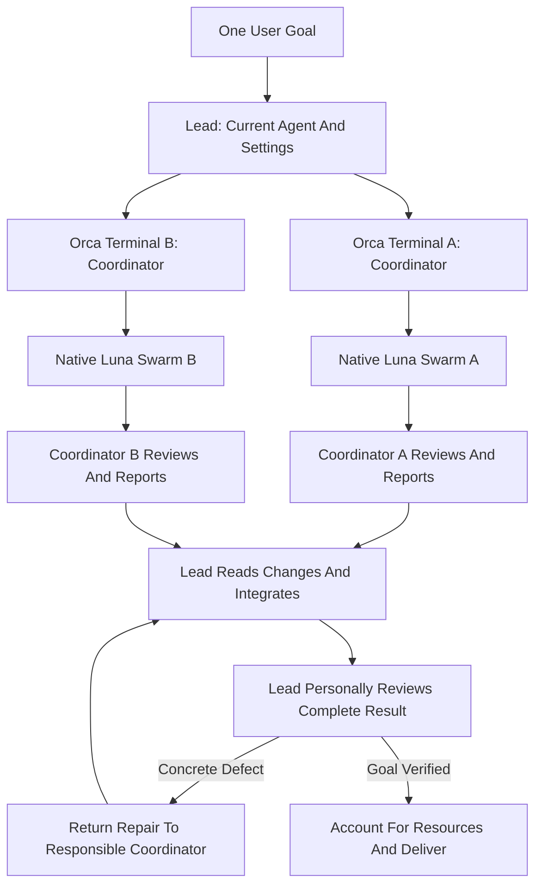

# Orca Swarm Lead

Turn one user goal into bounded team assignments without delegating ownership of the goal or final review. The lead manages dependencies and evidence throughout execution, not just when teams finish.

## Resource Guide

- Before launch, resolve and read `codex-luna-swarm`; in this repository it is `../codex-luna-swarm/SKILL.md`. It owns team-internal decomposition, native Luna execution, and coordinator review. Reading it as a dependency does not invoke it in the lead session.
- Read `references/team-contract.md` before creating a team Task or judging a team report. Store assignments and messages in Orca, not in a second registry.
- Read `tests/cases.md` when validating changes to this Skill. These are behavior specifications, not evidence that a runtime replay passed.

## Responsibility Boundary

| Actor | Configuration | Responsibility |
|---|---|---|
| Lead | Invoking agent's current model and reasoning settings, unchanged | Understand the shared goal; allocate ownership; supervise teams; settle cross-team decisions; personally review changes; accept the overall result |
| Astra coordinator | `gpt-6-astra`, `medium` reasoning effort | One supervised Orca terminal per team; run `codex-luna-swarm`; personally review team changes; report to the lead |
| Luna worker | Native subagent configuration owned by `codex-luna-swarm`: `gpt-5.6-luna`, `max` effort | Perform one bounded assignment and report to its coordinator |

This Skill owns team allocation, Orca orchestration, reporting requirements, cross-team responsibility, and whole-goal acceptance. The lead supplies those requirements in each team Task; `codex-luna-swarm` owns only the existing workflow inside one Swarm and does not need to know about a lead or Orca. Do not add a lead mode, reporting rules, runtime gates, or completion overrides to that dependency.

The reporting chain is worker -> Astra coordinator -> lead -> user. A coordinator can submit its assigned subgoal for acceptance, not declare the user's entire goal complete. Both the coordinator's review and the lead's own review are mandatory; neither substitutes for the other.

This Skill applies to the lead session only. Coordinators invoke `codex-luna-swarm`, not this Skill, and do not create other coordinators. Luna workers remain leaf agents. The lead routes instructions through the owning coordinator instead of becoming a second dispatcher for that team's workers.

## Runtime Boundary

Orca owns terminal placement, Run, Task, Dispatch, messaging, and supervised cleanup. Codex owns the native subagent tree inside each coordinator. These are different execution surfaces, not interchangeable lifecycle IDs.

- Resolve Orca from the environment's provided CLI entry point and load `ORCA skills get orchestration`, following the live guide's resolution rules. `ORCA` denotes that resolved executable, not a guessed binary path.
- Use the live guide for every Orca command and flag. Confirm the runtime is reachable and the lead can supervise coordinator terminals before assigning implementation.
- Verify that the installed Orca dispatch policy and Codex configuration permit a supervised coordinator to use native collaboration subagents. Do not assume an Orca child Dispatch may delegate merely because Codex exposes a spawn tool.
- If the guide, injected lifecycle instructions, or runtime prohibit that combination, report the incompatible boundary and stop the affected launch. Do not bypass it with a new Run, detached terminal, stripped preamble, alternate spawn tool, or a handoff that discards supervision.
- Inspect the resolved `codex-luna-swarm` in each coordinator's execution context and confirm its Astra coordinator and Luna worker configuration matches this Skill. Lead awareness is not a dependency requirement: supply team scope and reporting through the Task packet. A named Skill or startup claim alone does not establish compatible contents. A missing or incompatible dependency blocks the team; do not silently substitute `orca-luna-swarm` or copy a competing worker workflow here.
- Verify each coordinator's effective model and effort from runtime session metadata or its effective launch receipt, including reused terminals. A requested configuration or agent self-description is not verification. A mismatch or unknown configuration blocks implementation; account for the attempted launch's resources before any documented corrective launch.
- Coordinators are Orca-supervised Dispatches. Native Luna workers are not Orca Dispatches and must not be described as such. Native workers must not use their coordinator's Orca lifecycle authority or send `worker_done` on its behalf.

## Workflow

### 1. Establish One Goal And A Baseline

The lead personally establishes the user-visible outcome, inspected current behavior, constraints, acceptance conditions, and exclusions. Use an existing authoritative goal when one exists; otherwise keep the goal in the bound Orca Run. Team Tasks contain bounded assignment snapshots, not competing goal documents.

Inspect the workspace status, relevant existing diff, instructions, and validation entry points before assigning writes. Preserve pre-existing user changes and keep their baseline distinguishable from team changes. If safe attribution or ownership cannot be established, resolve that conflict before assigning the affected files.

Split by subgoal and acceptance evidence, not merely by directory or desired agent count. Form multiple teams only when at least two useful workstreams can proceed without conflicting write ownership. Start with two teams; add teams only for proven unassigned work within the user's resource limits. When that split is not useful, explain the concrete constraint and use one bounded team or direct lead execution without claiming multi-team parallelism. The lead review gate still applies.

### 2. Assign Teams And Dependencies

Create team Task specs using `references/team-contract.md`. Each coordinator receives a self-contained assignment because its terminal need not inherit the lead's conversation. State that the assigned subgoal is the complete task for that Swarm, provide the reporting route and required report events, and reserve shared-goal acceptance for the lead. This defines the task passed to `codex-luna-swarm`; it does not change that Skill's own completion or review rules.

- The lead assigns one team as write owner of each shared file or component. The coordinator may subdivide only within that ownership; team-local disjointness does not prove global disjointness.
- For a shared file, designate one owner and make other teams read-only there, or schedule writes sequentially. Worktrees do not remove semantic ownership conflicts.
- Make prerequisite evidence and interface expectations explicit. Launch independent work concurrently; do not start dependent writes against an unconfirmed assumption. Independent read-only investigation may proceed.
- Coordinators escalate requested scope, ownership, or shared-interface changes to the lead rather than expanding authority themselves. The lead updates affected assignments before dependent work resumes.
- Place coordinators in separate fresh Orca agent terminals in the active worktree by default. Create a worktree only for a user request or a demonstrated checkout/filesystem conflict, explain the reason, and perform required project setup.

Bind one Run for the shared goal and create the currently independent Tasks before launching any of their coordinators. Use runtime state as the authority for Task, Dispatch, and terminal identities. On continuation, inspect that state first and reuse a relevant live or retained team session instead of duplicating its assignment.

### 3. Launch And Establish Team Readiness

Start each coordinator through Orca's documented supervised launch with the required coordinator model and effort. Start all independent teams before waiting on one. Do not launch the lead's coordinators through Codex's native Luna-worker tool.

Require a startup report before team implementation: the coordinator confirms its resolved Skill, allowed native collaboration surface, assignment boundaries, and any blocking prerequisite. The lead verifies effective launch evidence independently. Readiness means configuration and authority are established, not that the subgoal is complete.

Inside that terminal, the coordinator invokes `codex-luna-swarm`, evaluates a useful worker split, runs permitted native Luna workers, and personally reviews their combined work. The lead does not prescribe unnecessary worker counts or rewrite the team's internal workflow.

A failed or ambiguous start is an observed partial operation, not permission to blindly retry. Inspect its stage and residual Task, Dispatch, and terminal state before recovery. Never allow two attempts to hold the same write assignment concurrently.

### 4. Manage Progress And Receive Every Team's Reports

Every coordinator reports startup, decision-relevant milestones, blockers or cross-team conflicts when discovered, and submission for lead review. Use Orca's supported active-Dispatch messaging and completion mechanisms, with the report contract in `references/team-contract.md`. Distilled evidence is required; transcripts and repeated status narration are not.

The lead uses rolling, bounded waits for messages rather than sleeping or busy polling terminals. Process every delivered report and blocking question, including mixed deliveries containing both success and failure. Validate each completion against its expected active Dispatch; copied IDs or report text do not establish lifecycle authority. An empty wait is a checkpoint: inspect live state and continue supervision while work is running. Elapsed time or silence alone does not justify interruption, replacement, or takeover, and the lead must not pressure coordinators to interrupt slow max-effort Luna workers.

Use reports to update decisions: resolve contradictory evidence at its source, release proven dependencies, narrow invalid assignments, or route concrete repairs to their owners. Report progress and meaningful blockers to the user without surrendering supervision or claiming delivery prematurely.

A coordinator sends Orca `worker_done` once for its own Dispatch only after its native workers have settled, its own review is complete, and its evidence-bearing submission is ready. A blocked or failed team uses the live guide's corresponding reporting mechanism; it must not label incomplete work as success. Completion notification is not lead acceptance. The coordinator then follows the runtime's idle and follow-up rules.

### 5. Accept Individual Team Submissions And Manage Lifecycle

For each settled team, the lead reads the real owned diff, checks decision-bearing evidence, and judges its assignment before choosing the session's next owner. A summary or passing tests alone cannot establish acceptance.

- While a Dispatch is active, send focused guidance to that Dispatch through the live guide's messaging mechanism.
- If a settled submission needs repair and its terminal is retained, start a new Task on that exact terminal. Do not mail a settled Dispatch expecting execution to restart or reuse settled lifecycle IDs.
- If accepted, reuse the terminal for an immediate authorized follow-up, otherwise release it as the guide requires. Retain a settled terminal only under an explicit user request supported and recorded by Orca.
- Before acknowledging settlement or ending supervision, account for every settled coordinator and any remaining native workers. Release is cleanup, not cancellation or proof that descendants stopped.
- If later review needs a released team, start a fresh verified coordinator with a complete repair packet; do not claim continuity with a closed terminal.

Replace a team only after failure or stopping is established and its required outcome remains incomplete. Before transferring write ownership, establish that the previous coordinator and its native workers can no longer modify that scope. Follow supported cancellation and descendant-accounting procedures; if their state remains unknown, expose the blocker and potentially live resources instead of creating competing writers. Never route around runtime limits to recover.

### 6. Lead Review And Whole-Goal Acceptance

For teams in isolated worktrees, collect the real source revision or patch and integrate through the repository's authorized procedure while preserving the captured baseline. Separate worktree results are not the integrated result, and placement grants no additional commit, push, or merge authority.

Enter final integration only when every required team outcome is complete or has genuinely left the authorized goal. Failure, delay, or a missing report does not supersede a required outcome. No outstanding team writer may race the review baseline.

The lead personally:

1. Inspects each team's actual changes and the complete integrated diff against the captured baseline, including new files and changes authored by the lead. Maps every change to the shared goal, an acceptance condition, or a named uncertainty.
2. Reads changed logic with its callers, callees, state ownership, and failure paths. Looks for cross-team interface mismatches, conflicting writes, duplicate rules, scope expansion, and regressions that team-local tests can miss.
3. Resolves conflicts at the authoritative implementation, preserving unrelated user edits. Rejects untraceable changes; does not integrate duplicate implementations as a shortcut.
4. Runs the available required checks covering affected behavior and whole-goal integration. Distinguishes actual passes, failures, blocked checks, and checks not run. Verifies important normal and boundary paths, not merely each team's report.
5. Confirms every overall acceptance condition has evidence for the final integrated state, not an earlier team revision. An unverified condition remains open and prevents an overall success claim.

Return concrete defects with evidence and acceptance conditions to the owning coordinator using Step 5's lifecycle rules. The coordinator repeats its own review, then the repaired result returns through integration and lead review. Any later edit invalidates review and validation for its affected paths; re-check those paths and their integration before delivery. Do not weaken tests or accept a team report in place of the lead's review.

The lead may make an authorized tightly coupled integration repair when the prior owner is no longer writing that scope. Apply the same gate and identify the lead-authored portion as self-reviewed, not independently reviewed.

### 7. Deliver Or Report A Specific Blocker

Only the lead can declare the shared user goal complete. Before delivery, account for every coordinator terminal and any unresolved native-worker resources through live runtime evidence.

Report the outcome against the goal, team assignments and dispositions, the lead's own review findings, actual verification results, and remaining risks or blockers. A team submission without lead acceptance is not a completed goal. Do not end the task merely because all coordinators sent completion messages.

## Boundaries

- Do not replace or reconfigure the invoking lead to match the coordinator model.
- Do not remove either review gate or delegate the lead's review to a coordinator, worker, or separate reviewer.
- Do not use this Skill to coordinate unrelated goals without an explicit scope change.
- Do not introduce a scheduler, DAG engine, consensus layer, persistent session registry, or duplicate lifecycle state. Orca and the native agent trees own execution state.
- Do not create recursive coordinator hierarchies, send native workers Orca lifecycle credentials, or treat runtime policy conflicts as optional.
- Delegation never expands the user's authorization. Commits, pushes, PRs, deployment, publication, deletion, and other shared or irreversible actions still require the relevant authorization.
- Do not present configured model IDs, written behavior cases, or static validation as evidence of a successful live run.

## Quality Standard

A successful multi-team run has one accountable lead, verified coordinator launches, useful independent team work, globally non-conflicting write ownership, reports from every team, both review gates, evidence for the shared goal in the final integrated state, and fully disclosed resource disposition. Missing evidence or an unsupported runtime combination is reported as blocked, not silently downgraded to apparent success.
