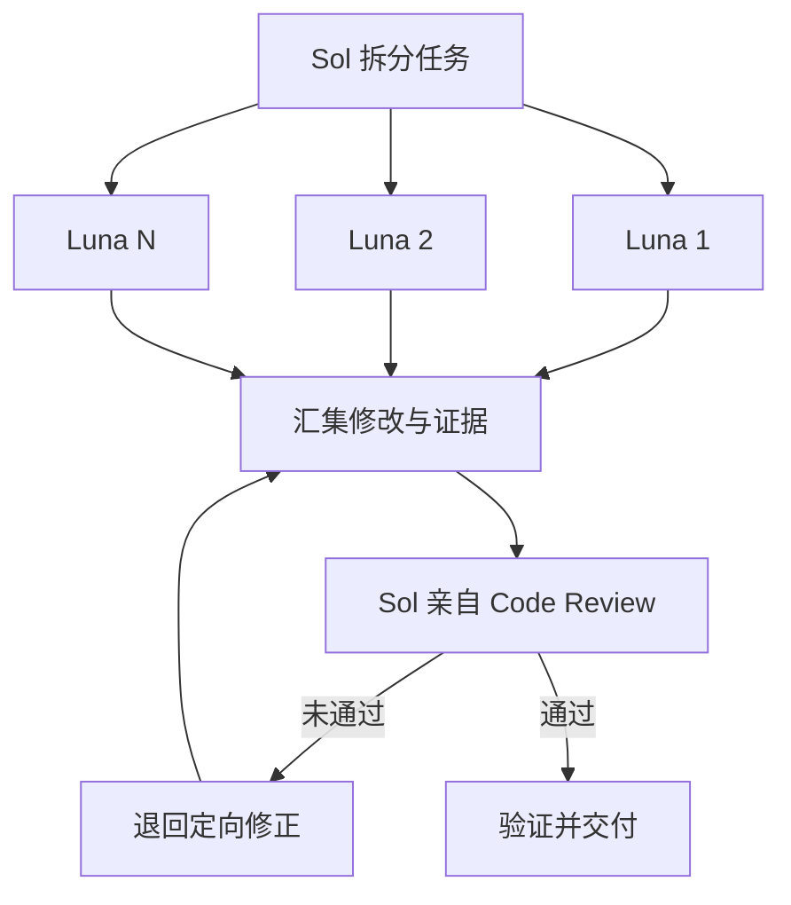

# Sol–Luna Swarm

Use one execution pattern: Luna workers investigate or implement in parallel, then Sol personally reviews the combined code before delivery. Parallelism provides speed; the Sol review gate provides safety. Do not split these into separate modes.



## Responsibility Boundary

| Work | Sol | Luna |
|---|---|---|
| Initial investigation | Perform the minimum investigation needed to define the problem and scope | Deepen independent lines of investigation |
| Code call paths | Define the boundary and verify critical paths | Investigate separate modules in parallel |
| External research needed by the coding task | Verify conclusions that affect decisions against authoritative sources | Investigate separate official sources or approaches |
| Root-cause decision | Make the final determination | Provide candidate causes and evidence |
| Code implementation | Implement directly or delegate | Act as the primary implementer |
| Tests and checks | Re-run and verify critical results | Run relevant checks first and report them |
| Code review | Perform it personally | Never substitute for Sol's review |
| Conflict resolution and delivery | Retain final decision authority | Do not make the final decision |

## Invariants

- Every worker is spawned with `model: "gpt-5.6-luna"`, `reasoning_effort: "max"`, and `fork_turns: "none"`.
- Luna workers must not spawn subagents or accept another worker's code as reviewed.
- Every code change must pass Sol's direct review. A Luna summary, test result, or self-review cannot replace this gate.
- Use the smallest useful worker set. Do not create a swarm when the task lacks at least two genuinely independent work units.
- Preserve the current authorization and safety boundaries. Never delegate approval decisions or use delegation to broaden scope.

## Workflow

### 1. Establish The Work

Before spawning workers, inspect enough evidence to state the user-visible goal, current behavior, constraints, acceptance conditions, and what remains out of scope. Separate independent work from work that depends on earlier findings.

If parallelism would not reduce meaningful uncertainty or wall-clock time, continue without a swarm and explain why.

### 2. Assign Independent Ownership

Give each Luna a bounded task packet:

```yaml
objective: one concrete outcome
facts: only the verified context needed for this task
scope: allowed files, components, or questions
write_owner: files this worker alone may modify; empty means read-only
acceptance: observable conditions for success
exclusions: actions and areas outside authority
return: findings, sources when research was performed, changed files, validation, and unresolved risks
```

Prefer two to four workers initially. Increase only when more independent units are already proven.

Workers that might touch the same file must not edit concurrently. Assign one writer and make the others read-only investigators, or run the dependent work sequentially.

### 3. Spawn Luna Workers

Use the collaboration subagent tool directly with:

```json
{
  "model": "gpt-5.6-luna",
  "reasoning_effort": "max",
  "fork_turns": "none"
}
```

Send the full bounded task packet because the worker receives no inherited conversation. Run independent tasks concurrently, then wait for their results without busy polling.

### 4. Integrate Evidence And Changes

Before review, account for every required worker outcome: it must be complete or explicitly superseded by Sol. If a worker fails, times out, or returns only a partial result, Sol must replan the missing work, replace it, or stop and report the blocker; never silently omit it.

Sol reads every worker result and inspects the actual workspace. Treat summaries as claims until supported by files, diffs, logs, or test output.

- Reconcile contradictions instead of silently choosing the most confident answer.
- Reject out-of-scope edits and unexplained files.
- Resolve integration at the authoritative source; do not preserve duplicate implementations as a shortcut.
- Request rework only when review produces concrete new evidence. Do not repeat an unchanged failed instruction.

### 5. Sol Code Review Gate

Sol personally reviews the combined result before declaring success:

1. Inspect the complete diff and map each change to the confirmed goal or root cause.
2. Read the changed logic in its caller, callee, state, and error-propagation context.
3. Look adversarially for incorrect assumptions, write conflicts, duplicate rules, hidden fallbacks, scope expansion, and regressions.
4. Run proportionate tests, type checks, builds, and lint where available and relevant.
5. Confirm the original problem is resolved and important normal paths still work.

If review fails, Sol either sends a focused repair task with the concrete defect and acceptance condition, fixes it within existing authority, or stops when further progress requires guessing or new authorization. Every repair must return to Step 4 and pass the complete Sol code review and validation gate again before delivery.

### 6. Deliver

The final response must identify:

- how work was divided and which workers changed files;
- what Sol found during its own code review;
- evidence that the original problem and normal paths were verified;
- tests and checks run, including failures or omissions;
- unresolved assumptions, risks, and unrelated findings.

Only Sol can mark the overall task complete.

## Boundaries

- Do not build a DAG engine, voting system, consensus layer, persistent memory, role registry, or recursive hierarchy unless a demonstrated failure requires it.
- Do not let worker count substitute for task decomposition or evidence quality.
- Do not ask multiple workers to make competing edits in the shared workspace.
- Do not treat passing tests as sufficient code review.
- Do not commit, push, deploy, publish, delete, or perform irreversible actions unless the user has separately authorized them.

## Quality Standard

A successful run gains real parallelism from independent Luna work, has no concurrent write ownership conflict, and ends with Sol independently inspecting the integrated code and verification evidence before delivery.
