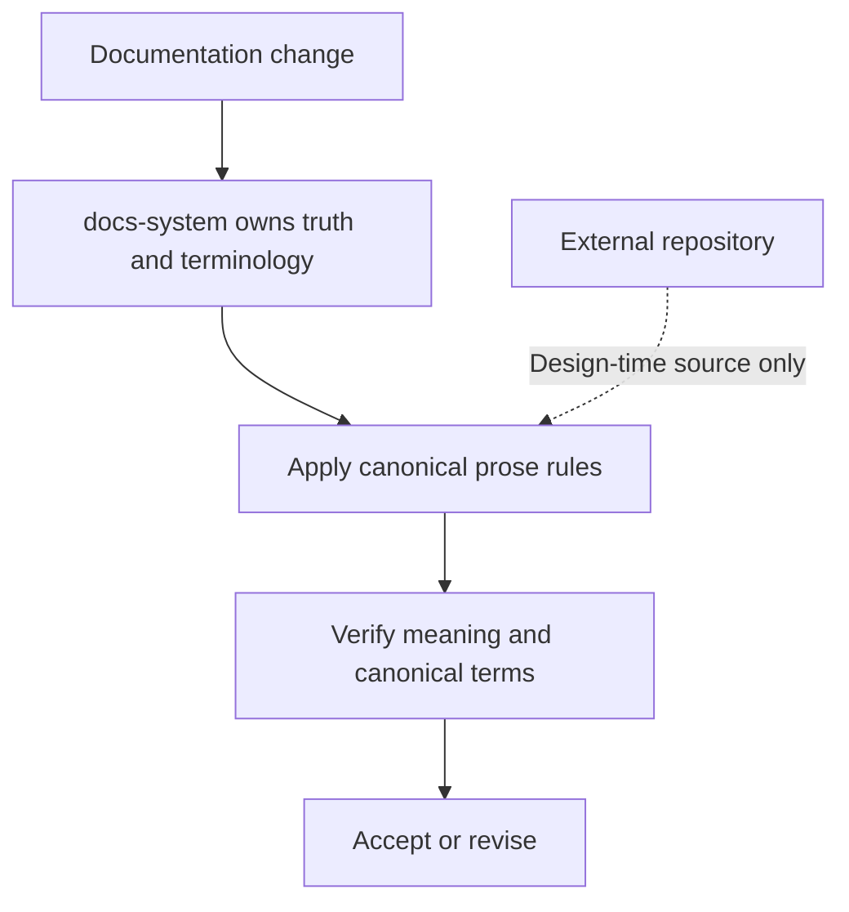

# Adapt STE-inspired prose rules into docs-system

## Summary

Adapt a bounded set of ASD-STE100-inspired structural rules into `docs-system`
as its single canonical prose policy. Treat
[`asd-ste100-skill`](https://github.com/danyuchn/asd-ste100-skill) only as a
design-time research source, never as a runtime component or source of certified
ASD-STE100 compliance.

## Problem

`docs-system` needs clearer rules for technical prose, but any runtime
delegation to `asd-ste100-skill` would make behavior depend on the environment.
A conditional fallback still creates two writing paths: repositories with the
external Skill can produce a different technical-document style from
repositories without it. Automatic installation or network retrieval would
also change user state and make an otherwise local workflow less predictable.

ASD-STE100 is a controlled language with both writing rules and a controlled
dictionary. The official specification contains 53 rules and an approved-word
vocabulary; correct compliance requires the complete standard and technical
knowledge. The official FAQ says its principles can be adopted in other
contexts, but that does not make an adapted workflow compliant with the full
standard. See the [official overview](https://www.asd-ste100.org/about_STE.html),
[FAQ](https://www.asd-ste100.org/STE_faq.html), and
[downloads](https://www.asd-ste100.org/STE_downloads.html).

The external Skill already distinguishes strict procedural writing from a
lighter explanatory mode and explicitly avoids reproducing the official
dictionary. Its useful portable contribution is therefore the rewrite method,
not a complete compliance engine. This assessment is based on
[`SKILL.md`](https://github.com/danyuchn/asd-ste100-skill/blob/e4d64d1dc7f80baa6c590bbf47a99280a90e1b40/SKILL.md)
and its
[writing rules](https://github.com/danyuchn/asd-ste100-skill/blob/e4d64d1dc7f80baa6c590bbf47a99280a90e1b40/references/writing-rules.md)
at commit `e4d64d1dc7f80baa6c590bbf47a99280a90e1b40`.

## Scope

- The prose guidance owned by `docs-system/references/prose.md`.
- Resource routing and authority wording in `docs-system/SKILL.md`.
- Behavior cases for environment-independent execution, semantic preservation,
  terminology, and rule activation from sentence meaning.
- Compliance boundaries for the local rules.

## Non-goals

- Certifying output as ASD-STE100 compliant.
- Reproducing or distributing the official ASD-STE100 dictionary.
- Detecting, installing, downloading, or invoking an external prose Skill at
  runtime.
- Building a prose linter in this change.
- Applying English-specific grammar or word-count rules to non-English prose.
- Replacing `docs-system` ownership, lifecycle, terminology, or reachability
  rules with a writing-style system.

## Proposal

### Authority and execution model

`docs-system` remains the sole authority for documentation ownership,
canonical truth, lifecycle, terminology, and reachability. Its bundled
`references/prose.md` becomes the authority for the minimum prose behavior
required by this Skill.

The external repository contributes design-time evidence only.
`docs-system` does not detect, install, invoke, or delegate to its Skill. The
same local rules and verification gates apply regardless of which Skills are
installed in the runtime.

If a user asks `docs-system` for certified ASD-STE100 output, report that
certification is outside this workflow. Do not switch prose engines. A user may
run another workflow separately, but content entering governed documentation
must still satisfy the canonical local prose rules before acceptance.

### Integration into docs-system

Integrate the extracted mechanisms through existing `docs-system` assets. Do
not add a dependency layer or another runtime component.

| Artifact | Responsibility | Must not contain |
| --- | --- | --- |
| `references/prose.md` | Own the canonical prose invariants, sentence-triggered rules, rewrite procedure, exceptions, and non-English boundary. | External invocation instructions, copied external content, the official dictionary, or claims of ASD-STE100 compliance. |
| `SKILL.md` | Route wording, terminology, evidence language, and normative language work to `references/prose.md`; keep ownership and lifecycle checks around the rewrite. | A second copy of the prose rules, Skill discovery, installation checks, or fallback behavior. |
| `tests/cases.md` | Record behavior cases for semantic preservation, canonical terminology, sentence-triggered rules, unchanged clear prose, non-English content, and environment independence. | Exact-output assertions or tests of the external Skill. |
| `scripts/validate.py` | Continue checking deterministic document contracts and links. | Semantic prose lint or an ASD-STE100 compliance claim. |

The runtime sequence is:

1. Identify the canonical owner, current facts, and established terminology.
2. Read `references/prose.md` when prose meaning or terminology is in scope.
3. Apply the local rules whose semantic triggers are present.
4. Reject or revise any rewrite that changes facts, modality, scope, numbers,
   negation, conditions, uncertainty, or canonical terminology.
5. Run the existing structural and repository-specific validation before
   delivery.

The external repository participates only before implementation. Use the
research conclusions to define local behavior without copying its text,
examples, files, or other repository assets.

### Rule activation

Use one canonical prose policy for every governed document. Apply individual
rules when the sentence meaning triggers them:

| Sentence meaning | Required behavior |
| --- | --- |
| Action, procedure, requirement, or safety condition | State the actor, condition, action, and observable result explicitly. |
| Explanation, rationale, tradeoff, or uncertainty | Preserve the causal relationship, qualification, and necessary nuance. |
| Any maintained claim | Preserve facts, modality, scope, numbers, negation, and canonical terminology. |

Do not classify an entire document into a prose mode. One document can contain
several sentence functions, but every sentence remains governed by the same
policy and terminology.

For non-English prose, apply language-neutral invariants such as semantic
preservation, explicit conditions, stable terminology, and paragraph focus.
Do not translate English sentence-length, tense, phrasal-verb, or approved-word
rules mechanically.

### Adapted rule set

The bundled baseline must be small enough to maintain locally and strong enough
to produce predictable prose without the external Skill.

| Rule | Strength | Adaptation in docs-system |
| --- | --- | --- |
| Preserve meaning | Invariant | Do not add facts or change modality, negation, scope, numbers, safety conditions, or uncertainty. |
| One term per concept | Invariant | Use the canonical owner's term; do not rotate synonyms for style. |
| Explicit actor and condition | Strong default | Prefer active voice when the actor matters. Permit passive voice when the actor is unknown or irrelevant. |
| One instruction or claim per sentence | Conditional | Require it when combining actions or claims creates ambiguity; otherwise use it as a clarity diagnostic. |
| One topic per paragraph | Strong default | Split paragraphs when their claims have different owners or purposes. |
| Lists for sequences and conditions | Strong default | Use a list for three or more parallel steps, conditions, or alternatives. |
| Direct verbs and concrete wording | Strong default | Prefer verbs over nominalizations; avoid ambiguous phrasal verbs and unmeasured promotional adjectives. |
| Sentence and noun-cluster length | Diagnostic | Flag difficult text for review; do not rewrite precise meaning only to satisfy a numeric limit. |
| Punctuation and tense | Diagnostic | Split semicolon-linked independent claims when that improves clarity. Prefer simple current-state wording, but preserve modality and temporal meaning. |
| Already-clear prose | Invariant | Do not rewrite text solely to demonstrate that the rule set ran. |

### Rejected alternatives

1. **Runtime delegation to `asd-ste100-skill` in any mode.** This creates
   environment-dependent prose and more than one effective writing authority.
2. **Automatic installation or runtime download.** This mutates user state,
   requires network access, and makes the documentation workflow nondeterministic.
3. **Vendor the entire external Skill.** This duplicates another maintained
   system and obscures which project owns the behavior.
4. **Copy the official dictionary.** The official vocabulary is part of the
   controlled standard and is not required for the bounded clarity objective.
5. **Add a regex linter now.** The target repository has no linter on its main
   branch. The proposed linter remains an
   [open pull request](https://github.com/danyuchn/asd-ste100-skill/pull/5), and
   hard lexical checks would create false confidence about compliance.

## Migration

1. Add the canonical local baseline to
   `.agents/skills/docs-system/references/prose.md`, including the rewrite
   sequence, exceptions, and non-English boundary.
2. Update `.agents/skills/docs-system/SKILL.md` to route prose work to the local
   baseline without copying its rules or adding external Skill discovery.
3. Add behavior cases for sentence-triggered rules, semantic preservation,
   non-English content, and identical execution rules with the external Skill
   present or absent.
4. Keep `scripts/validate.py` limited to deterministic structure and link
   checks; do not add semantic prose lint.
5. Run structural validation and replay the focused behavior cases.
6. Review the resulting diff for duplicated authority or copied external
   content before changing this proposal to `implemented`.

No persistent data or external installation state changes. Rollback consists of
reverting the new prose rules, routing text, and behavior cases together.

## Verification

- With `asd-ste100-skill` present and absent, `docs-system` uses the same local
  rules, resource path, and verification gates. It never detects or invokes the
  external Skill.
- A request for certified ASD-STE100 output does not switch prose engines or
  produce a compliance claim; it reports the boundary of this workflow.
- A precise long sentence is not shortened when shortening would alter meaning;
  it is left intact or surfaced for review.
- Already-clear prose remains unchanged.
- Sentences carrying actions, requirements, or safety conditions use explicit
  actors, conditions, actions, and observable results.
- Sentences carrying explanations, rationale, tradeoffs, or uncertainty retain
  their causal relationships and necessary nuance.
- Non-English prose is not subjected to English-only lexical or grammar checks.
- No output is labeled ASD-STE100 compliant unless it was independently checked
  against the complete official standard and dictionary outside this workflow.
- `SKILL.md` routes to `references/prose.md` without copying the canonical rule
  set, and `scripts/validate.py` contains no semantic prose checker.
- `references/prose.md` contains no copied external Skill text, examples,
  repository assets, official dictionary, license file, or attribution block.
- Run `python3 .agents/skills/docs-system/scripts/validate.py .` and record a
  passing result.
- Run `PYTHONDONTWRITEBYTECODE=1 python3 -m unittest discover -s
  .agents/skills/docs-system/tests -v` and record a passing result.

## Outcome

Implemented the single canonical prose policy in
[`references/prose.md`](../../.agents/skills/docs-system/references/prose.md).
The policy now owns semantic invariants, sentence-triggered rules, composition,
rewrite checks, current-state evidence language, normative language, and the
non-English boundary.

[`SKILL.md`](../../.agents/skills/docs-system/SKILL.md) now routes every governed
prose change through that policy without copying its rules or delegating to
another prose system. [`tests/cases.md`](../../.agents/skills/docs-system/tests/cases.md)
records the semantic-preservation, terminology, sentence-function, length,
non-English, unchanged-prose, and environment-independence behaviors.

No runtime dependency, external Skill detection, prose linter, external source
content, dictionary, license file, or attribution block was added. The generic
validator remains responsible only for deterministic document contracts.

Validation completed on 2026-08-31: the documentation scan passed with no
broken links, all 30 unit tests passed, Skill Creator validation passed, and the
Dao quality check passed. Behavior evidence remains the reviewable cases and
same-context adversarial review; no independent model evaluation was claimed.
