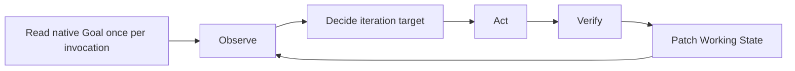

# Codex Goal Loop Refactor Proposal

## Summary

Integrate `codex-goal-loop` with the native Codex Goal lifecycle while preserving the structured goal contract currently stored under `.goal/`.

The refactored design must keep these properties:

- Codex can turn an explicit user request into a structured goal contract.
- Large goals retain a title, L0 Objective, L1 Acceptance Criteria, constraints, non-goals, and resumable working state.
- The native Codex Goal owns lifecycle state and usage accounting.
- The same fact is never authoritative in both the native Goal and the goal file.
- Observe, Decide, Act, Verify, and evidence-based completion remain the execution discipline.

## Problem

The former design assigned lifecycle state to both the structured goal file and
the native Codex Goal. Those independent state machines could disagree after a
native edit, pause, resume, blocked transition, or completion. The structured
file was still needed for the detailed semantic contract, so the required
change was to separate authority instead of removing the file.

## Scope

- Native Goal operation boundaries and lifecycle ownership.
- Structured goal-contract identity, schema, location, and authority.
- Start, resume, checkpoint, handoff, migration, and lifecycle transitions.
- The `codex-goal-loop` instructions, template, agent metadata, behavior cases,
  repository description, and local `.goal/` boundary.

## Non-goals

- Replacing native Codex Goal with a custom scheduler or runner.
- Copying the entire structured contract into the native objective.
- Adding locks, event ledgers, subgoal trees, automatic commits, or background wake-up behavior.
- Supporting multiple simultaneous native Goals in one active Codex Goal Loop.
- Refactoring unrelated skills or repository configuration.

## Proposal

### Native Goal Interface

The refactor depends only on the following native operations. Provenance is stated per operation so runtime-specific behavior is not mistaken for a portable Skill invariant.

| Operation | Caller | Behavior | Provenance | Fallback when unavailable |
| --- | --- | --- | --- | --- |
| `get_goal({})` | Agent | Reads the current Goal, status, objective, budget, and usage. | Verified in the current runtime tool contract. | Stop before reading or mutating a contract; report that native Goal state is unavailable. |
| `create_goal({ objective, token_budget? })` | Agent | Creates a Goal only after an explicit user request. It fails while an unfinished Goal exists. A token budget is included only when explicitly requested. | Verified in the current runtime tool contract. | Preserve any newly drafted contract as an unlinked draft and report the creation failure. Do not begin iterations. |
| `update_goal({ status: "complete" })` | Agent | Marks the Goal complete only after the objective is achieved and no required work remains. | Verified in the current runtime tool contract. | Report verified completion without claiming that native lifecycle completion succeeded. |
| `update_goal({ status: "blocked" })` | Agent | Marks the Goal blocked only when the current native contract permits it; the current runtime requires the same blocker to persist for three consecutive Goal turns. | Verified runtime-specific behavior; the Skill defers to the active tool contract rather than hardcoding this threshold. | Keep the Goal active, record the pending external decision, and report the blocker without claiming a blocked transition. |
| `/goal edit`, `/goal pause`, `/goal resume`, `/goal clear` | User or host | Edits or controls the current Goal through the native command surface. | Verified in the cited official command documentation. | Stop and tell the user which native operation is required. Do not emulate it in the goal file. |

There is no agent tool for editing an active Goal objective, pausing, resuming, or clearing it. The design must not imply otherwise.

The public Goal command contract and the recommendation to reference longer project files are documented in [Follow a goal](https://learn.chatgpt.com/use-cases/follow-goals) and [Developer commands](https://learn.chatgpt.com/docs/developer-commands?surface=cli).

### Ownership Conflict

The current design assigns overlapping ownership:

- `.goal/<title-datetime>.md` is declared authoritative for the objective and acceptance criteria.
- The same file also stores `CONTINUE`, `BLOCKED`, or `DONE`.
- Native Codex Goal separately stores the active objective and lifecycle status.

This creates two independent lifecycle state machines. They can disagree after native Goal edits, pause or resume operations, blocked transitions, or completion.

The goal file is not the problem. The duplicated ownership is.

### Proposed Authority Model

| Concern | Sole authority | Rule |
| --- | --- | --- |
| Goal display title and semantic contract | `Protected Goal` in the referenced goal file | Contains the display title, L0, L1, constraints, and non-goals. |
| Goal identity and lifecycle | Native Codex Goal | Owns active, paused, blocked, complete, budget, and usage state. |
| Current execution checkpoint | `Working State` in the goal file | Replaceable evidence summary; never authoritative for lifecycle. |
| Current repository and external reality | Direct observation | Overrides stale Working State claims. |

The native Goal objective is a stable pointer and execution clause, not a second copy of the contract.

Example native objective:

```text
Contract: .goal/<title-datetime>.md

Pursue the referenced Protected Goal as the authoritative objective, acceptance
criteria, constraints, and non-goals. Continue until every acceptance criterion
has current observable evidence, then complete this Codex Goal. Do not change
Protected Goal without explicit user approval.
```

The contract locator has a deterministic protocol:

- The objective contains exactly one line beginning with `Contract: `.
- Its value is a workspace-root-relative path with no glob or environment variable.
- The referenced file must exist below the active workspace before any iteration begins.
- A missing, ambiguous, absolute, or escaping path is an authority failure. Stop and request correction; never reconstruct the contract from memory.
- The filename is an immutable locator. The `# Goal: <title>` heading is display metadata and is not copied into the native objective.

### Goal File Schema

Keep the existing two-section structure with one ownership change.

```md
# Goal: <title>

## Protected Goal

### L0 Objective

### L1 Acceptance Criteria

- A1: ...

### Constraints

### Non-goals

---

## Working State

### Acceptance Status

- A1: UNVERIFIED | VERIFIED
  - Evidence: <observable result and locator>
  - Observed: <timestamp or invocation>
  - Invalidated by: <changes that require re-verification>

### Current Iteration Target

### Established Facts

### Current Hypothesis

### Important Evidence

### Unknowns / Risks

### Pending External Decision

### Next Best Action
```

Remove `Working State > Status`. The file must not store `CONTINUE`, `BLOCKED`, or `DONE` as lifecycle state.

`Acceptance Status` remains a non-authoritative evidence index. It must point to observable evidence and state when that evidence becomes stale. On resume, re-verify criteria affected by later changes or time-sensitive external facts; do not discard still-valid evidence merely because a new invocation began. Native Goal completion still requires Codex to reconcile every entry against current reality.

### Start Flow

#### Explicit Goal Request

Treat an explicit `$codex-goal-loop <intent>` request, or another direct request to create a Codex Goal, as authority to start the flow. Automatic Skill selection and `$codex-goal-loop` without an objective do not authorize native Goal creation.

1. Check whether a native Goal is already active.
2. Choose the contract location from the durability requirement:
   - For the default same-workspace mode, use `.goal/<title-datetime>.md`; ensure the workspace-root `.gitignore` contains `/.goal/` and verify that the proposed path is ignored. Stop before writing when this cannot be ensured.
   - When the user explicitly requires cross-machine, fresh-clone, or cloud resume, obtain approval for a workspace-root-relative tracked project-document path. Do not add it to `.gitignore`, commit it, or publish it automatically.
3. Investigate enough context to distinguish facts, assumptions, acceptance conditions, constraints, and non-goals.
4. If a material ambiguity would change success or scope, present the proposed contract and request the missing decision.
5. Otherwise create the contract at the selected location from the agreed or sufficiently explicit intent.
6. Create the native Codex Goal with an objective that contains the deterministic `Contract:` locator.
7. Re-read the native Goal and goal file before beginning the first iteration.

If native Goal creation fails after the file is written, retain the file as an unlinked draft and report the exact failure. Do not run the loop and do not silently delete or replace the draft. A later explicit retry must reuse or explicitly supersede it.

Do not create a native Goal merely because an ordinary task appears long-running. Native Goal creation still requires an explicit user request.

#### Existing Native Goal

Check lifecycle status before inspecting its locator:

- When active, continue with the locator branches below.
- When paused or blocked, stop and report the last observed state plus the native user action required to resume. Do not run an iteration through that control boundary.
- When complete, treat it as finished; a new explicit goal request may create a new Goal.
- When no Goal exists, continue the explicit Start Flow.

For an active native Goal, use this exhaustive locator branch:

| Observed state | Required action |
| --- | --- |
| It contains one valid `Contract:` locator to an existing file. | Resume that contract. |
| It contains a locator to a missing or invalid file. | Stop and request restoration or an explicit `/goal edit`; never reconstruct silently. |
| It has no locator, but its objective matches the requested intent. | Draft the contract, obtain approval, then ask the user to use `/goal edit` to install the locator before resuming. |
| It has no locator and represents a different intent, or points to another valid contract. | Stop and ask the user to continue, complete, pause, or clear that Goal. Do not create a second Goal. |

### Resume Flow

1. Read the current native Goal.
2. Resolve the goal-file path from the exact `Contract:` locator.
3. Read `Protected Goal` and `Working State` completely.
4. Re-observe relevant repository, tool, and external state.
5. Reconcile stale checkpoint claims with current evidence and each criterion's invalidation conditions.
6. Select the smallest highest-value iteration that advances an unverified criterion or removes a material uncertainty.

The file path is discovered from the native Goal. The host no longer needs a separate goal-file handoff parameter.

#### Durability Boundary

The default `.goal/` contract is intentionally local and gitignored. Resume is supported only while the same workspace data remains available; the native lifecycle handle does not make a missing local contract portable.

If cross-machine, fresh-clone, or cloud resume is an explicit requirement, the contract must instead live in a user-approved tracked project document. The same `Contract:` protocol applies. The Skill must not commit or publish the contract automatically.

### Contract Changes

Codex must never autonomously reinterpret or edit `Protected Goal`.

When evidence shows that L0, L1, constraints, or non-goals must change:

1. Explain the conflict and its evidence.
2. Propose the exact contract change.
3. Wait for explicit user approval.
4. Update `Protected Goal` after approval.
5. Invalidate any acceptance evidence affected by the change.

The native objective normally remains unchanged because it points to the contract rather than duplicating it.

### Iteration and Checkpoint Rules

Keep the current loop:



- Each action must advance an acceptance criterion or reduce a material uncertainty.
- Failed verification changes the evidence, hypothesis, approach, or next action.
- Do not repeat an unchanged action without new evidence.
- Patch only `Working State` during ordinary iterations.
- Treat plans, prior checkpoints, and historical tests as evidence, not truth.

### Native Lifecycle Mapping

#### Continue

When another authorized action can advance the goal, keep the native Goal active and record the next checkpoint. Do not persist a parallel `CONTINUE` status.

#### Blocked

Report an authority boundary or unavailable required input immediately, but transition the native Goal to blocked only when the current native Goal contract permits it. Do not implement a second blocker counter or separate blocked state in the goal file.

When the native blocked transition is not yet permitted, keep the Goal active, write the exact request under `Pending External Decision`, and report what input is required. This text is the evidence used to recognize whether the same blocker persists across Goal turns; do not keep a parallel local counter. Context reset, one failed approach, and execution-budget exhaustion remain handoffs rather than blockers.

Pause, resume, and clear remain native user or host operations.

#### Complete

Complete the native Goal only when:

- Every L1 criterion has current observable evidence.
- Relevant existing normal paths remain valid.
- For each criterion, Codex has identified the strongest realistic observation that would falsify it and checked that observation when accessible.
- Every validation command explicitly required by `Protected Goal` has succeeded.

After the native completion succeeds, report its final status and usage. Do not write `DONE` into the goal file.

### Handoff Format

At an invocation boundary, report:

```md
Native Goal as last observed: active | paused | blocked | complete
Contract: .goal/<title-datetime>.md
Acceptance: verified and unverified criterion IDs
Evidence: most important current observations
Pending decision: exact external input required, if any
Next: next action, external decision needed, or completion statement
```

The native Goal is the resumable lifecycle handle. The contract path is derived from its objective.

### File-Level Refactor Plan

#### `.agents/skills/codex-goal-loop/SKILL.md`

- Use this intent-routable description: `Pursue an explicitly requested bounded goal, or continue a previously established goal contract, through repeated evidence-driven Observe, Decide, Act, and Verify iterations backed by the native Codex Goal lifecycle. Use for long-running or autonomous work; do not use for ordinary one-shot tasks.`
- Replace file-owned lifecycle instructions with the authority model above.
- Add native Goal start, resume, completion, and blocked mappings.
- Preserve L0/L1/L2 discipline and the Observe/Decide/Act/Verify loop.
- Remove the runner-owned goal-file-path contract.
- Preserve the Responsibility Boundary section and the rules against premature blocking and treating failed verification as a blocker.

#### `.agents/skills/codex-goal-loop/references/goal-template.md`

- Keep the structured contract template.
- Remove `Working State > Status`.
- Clarify that `Protected Goal` owns semantics and native Goal owns lifecycle.
- Change the heading to `# Goal: <title>` and add evidence metadata plus `Pending External Decision`.

#### `.agents/skills/codex-goal-loop/agents/openai.yaml`

- Keep routing based on user intent rather than unknowable runtime state.
- Use `short_description: "Run structured contracts through Codex Goals"`.
- Use `default_prompt: "Use $codex-goal-loop to create or resume a native Codex Goal backed by a structured goal contract, and pursue it until its acceptance criteria are verified or external authority is required."`.

#### `.agents/skills/codex-goal-loop/tests/cases.md`

- Add one realistic forward-test case for each A1-A8 invariant.
- Specify initial native Goal state, contract contents, user input, expected tool transition, expected file mutation, and prohibited behavior.
- Keep the cases behavioral; do not assert incidental wording or internal implementation details.

#### `README.md`

- Explain the split between the native lifecycle handle, structured contract, and replaceable checkpoint.
- Replace the claim that work stops only at local `BLOCKED` or `DONE` with the native lifecycle ownership model.

#### `.gitignore`

- Keep `/.goal/` because structured contracts and working checkpoints remain local runtime artifacts.

## Migration

Existing goal files remain readable.

When resuming a legacy file:

1. Read its `Protected Goal` as the semantic contract.
2. Ignore its stored `Status` for lifecycle decisions.
3. Create or edit the native Goal to reference the file only with explicit user authority.
4. Remove the legacy `Status` field on the next meaningful checkpoint update only after the native Goal successfully references the file.

No bulk migration or automatic rewrite is required.

## Verification

### Acceptance Criteria

- A1: An explicit `$codex-goal-loop` request can produce a structured goal file and one native Codex Goal that references it.
- A2: The native objective does not duplicate L0, L1, constraints, or non-goals.
- A3: Resume begins from the native Goal, resolves exactly one valid `Contract:` locator without a separate handoff argument, and stops safely when the contract is unavailable.
- A4: Ordinary checkpoints do not persist `CONTINUE`, `BLOCKED`, or `DONE`.
- A5: Completion and blocked transitions follow the native Goal API contract.
- A6: A user-approved Protected Goal refinement invalidates affected acceptance evidence without requiring duplicated objective edits.
- A7: Legacy goal files remain resumable without bulk migration.
- A8: Skill metadata, instructions, template, and README describe the same authority model.

### Validation Plan

1. Run the `skill-creator` quick validator when available; otherwise validate frontmatter, naming, reference links, and unfinished placeholders manually. The repository does not contain its own validator.
2. Test a new explicit goal with multiple acceptance criteria; assert that the native objective contains one valid `Contract:` line and does not copy Protected Goal content.
3. Resume the goal in a later invocation; assert that the same contract is resolved without another path parameter.
4. Test missing, ambiguous, absolute, and workspace-escaping locators; assert that all stop before iteration.
5. Simulate native Goal creation failure after file creation; assert that the unlinked draft remains and no iteration starts.
6. Force one failed implementation attempt; assert that the Skill changes L2, leaves lifecycle active, and records new evidence.
7. Introduce a contract conflict; assert that Protected Goal is unchanged until user approval and affected evidence is invalidated afterward.
8. Present an active Goal whose contract has at least one criterion without current evidence, then request completion; assert that Codex does not call `update_goal({ status: "complete" })` and reports the missing evidence.
9. Verify that successful completion updates only native lifecycle state and that the goal file contains no lifecycle status.
10. Exercise each existing-Goal branch, including unrelated intent and missing contract.
11. Resume one legacy goal file; assert that legacy Status is ignored and removed only after native linkage succeeds.
12. Compare `SKILL.md`, `goal-template.md`, `openai.yaml`, and `README.md`; assert that all assign semantic authority to the contract and lifecycle authority to native Goal.

## Outcome

The refactor was implemented in the canonical
[`codex-goal-loop` instructions](../../.agents/skills/codex-goal-loop/SKILL.md),
the [goal contract template](../../.agents/skills/codex-goal-loop/references/goal-template.md),
the [behavior cases](../../.agents/skills/codex-goal-loop/tests/cases.md), and
the [agent metadata](../../.agents/skills/codex-goal-loop/agents/openai.yaml).
The native Codex Goal now owns lifecycle, budget, and usage. `Protected Goal`
owns goal semantics, and `Working State` remains a replaceable evidence
checkpoint without a parallel lifecycle status.

No Decision record was required: this Proposal preserves the implementation
history, while the linked Skill resources own current behavior.
